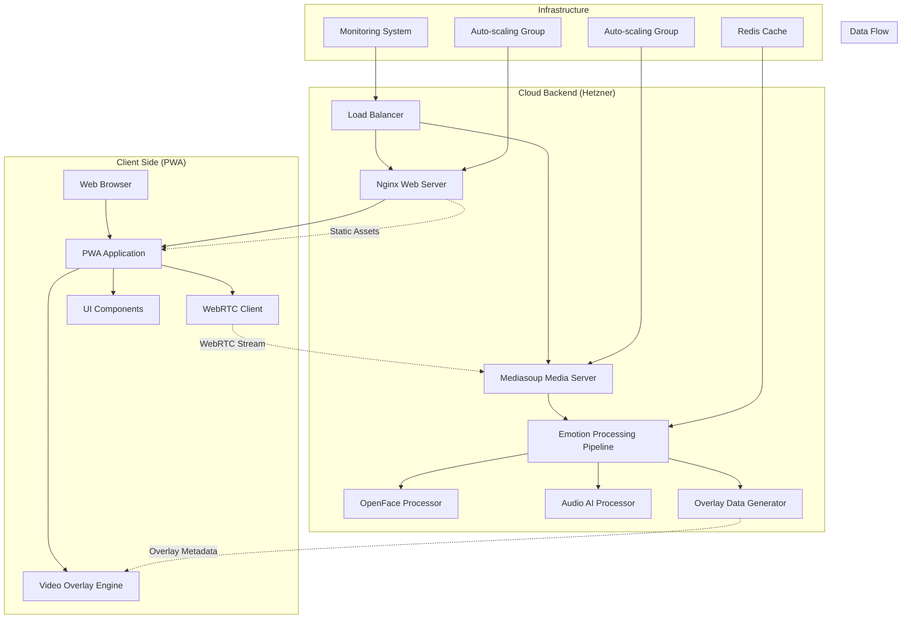
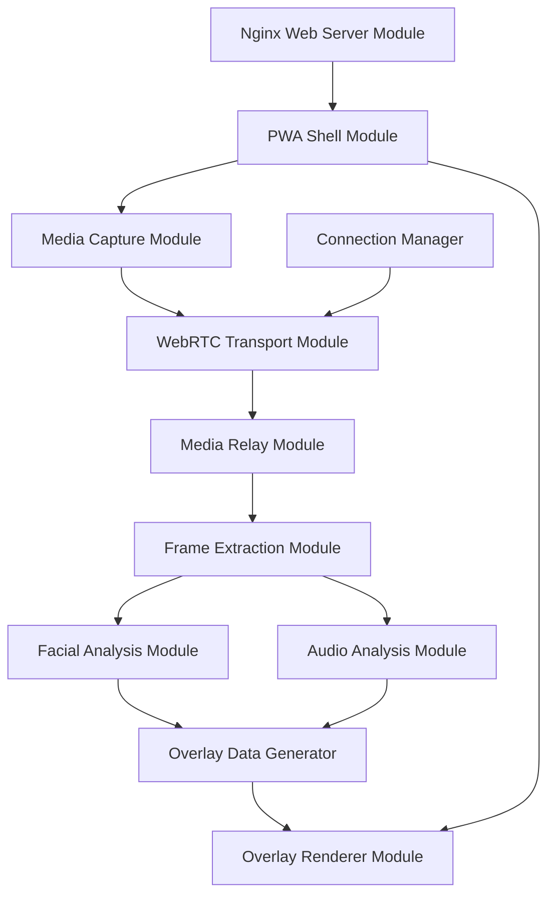

# Design Document

## Overview

The Emotion Recognition PWA is a real-time system that captures video and audio from user devices, streams the media to a cloud backend for AI-powered emotion analysis, and displays emotion overlays on the live video feed. The system is designed to handle 1000 simultaneous connections while maintaining sub-500ms latency.

The architecture follows a client-server model with WebRTC for real-time media streaming, Mediasoup for scalable media relay, OpenFace for facial emotion recognition, and AI models for voice emotion analysis.

## Usage Scenarios (Gherkin Style)

### Scenario 1: User Starts Emotion Recognition Session

```gherkin
Feature: Real-time Emotion Recognition
  As a user
  I want to start an emotion recognition session
  So that I can see my emotions analyzed in real-time

Scenario: Successful session initialization
  Given the user opens the PWA in their browser
  When the user clicks "Start Emotion Recognition"
  Then the Media Capture Module requests camera and microphone permissions
  And the browser displays permission dialog for camera and microphone access
  When the user grants permissions
  Then the Media Capture Module creates MediaStream with video constraints (1280x720, 30fps) and audio constraints (48kHz, stereo)
  And the PWA Shell Module displays the live video feed
  And the WebRTC Transport Module initializes peer connection with STUN servers
  And the WebRTC Transport Module connects to signaling server
  And the Connection Manager Module generates unique sessionId and creates session record
  Then the system displays "Connected - Ready for emotion analysis" status message
```

### Scenario 2: Real-time Emotion Processing Pipeline

```gherkin
Scenario: Processing live video and audio for emotions
  Given the user has an active emotion recognition session
  And the WebRTC connection is established
  When the user's face appears in the video feed
  Then the Media Capture Module streams video frames at 30fps via WebRTC to Mediasoup server
  And the Media Relay Module receives RTP H.264 video packets on WebRtcTransport
  And the Media Relay Module creates Producer for incoming video stream
  And the Media Relay Module forwards RTP packets to Frame Extraction Module via PlainTransport
  And the Frame Extraction Module uses FFmpeg to decode RTP video streams to RGBA frames
  And the Frame Extraction Module converts video frames to processable format at 10fps
  And the Facial Analysis Module receives VideoFrame with 1280x720 pixel data
  And the Facial Analysis Module processes frames using OpenFace toolkit
  And the Facial Analysis Module extracts facial Action Units for emotion classification
  And the Facial Analysis Module maps Action Units to basic emotions (Happy, Sad, Angry, etc.)
  And the Audio Analysis Module processes 1-second audio chunks using MFCC feature extraction
  And the Audio Analysis Module analyzes audio using trained CNN emotion model
  And the Audio Analysis Module classifies emotions from voice patterns
  Then the Overlay Data Generator combines facial emotions (confidence: 0.85, emotion: "happy") with audio emotions (confidence: 0.72, emotion: "happy")
  And the Overlay Data Generator creates JSON payload: {"sessionId": "abc123", "timestamp": 1642781234567, "facialOverlays": [{"faceId": "face_1", "boundingBox": {"x": 320, "y": 180, "width": 200, "height": 240}, "emotionLabel": "Happy", "confidence": 0.85, "color": "#00FF00"}], "audioOverlay": {"emotionLabel": "Happy", "confidence": 0.72, "position": "top"}}
  And the Media Relay Module sends overlay data via WebRTC DataChannel named "overlayData"
  And the WebRTC Transport Module receives overlay data on client side
  And the Overlay Renderer Module draws green bounding box at coordinates (320, 180, 200x240) on Canvas element
  And the Overlay Renderer Module displays "Happy (85%)" label above bounding box
  And the Overlay Renderer Module shows "Audio: Happy (72%)" indicator at top of video
  Then the user sees real-time emotion overlays on their live video feed
  And the total processing latency is measured at 420ms from capture to display
```

### Scenario 3: Multiple Users Concurrent Processing

```gherkin
Scenario: System handles 1000 concurrent users
  Given the Mediasoup server is running with 4 workers (one per CPU core)
  And each worker has Router configured with VP8, H264, Opus, PCMU codecs
  And Redis cluster is running for session state management
  And Nginx load balancer is distributing connections across 4 Mediasoup instances
  When 1000 users simultaneously start emotion recognition sessions
  Then the Connection Manager Module creates 1000 unique sessionIds
  And the Media Relay Module distributes sessions across workers using round-robin: Worker1(250), Worker2(250), Worker3(250), Worker4(250)
  And each worker creates WebRtcTransport with DTLS/SRTP for secure media transmission
  And the Frame Extraction Module processes 10,000 video frames per second (10fps × 1000 users) using Redis queue with 8 worker processes
  And the Facial Analysis Module processes frames in parallel using 16 worker threads
  And the Audio Analysis Module processes 1000 audio chunks per second using GPU acceleration
  And the system maintains CPU usage below 80% across all servers
  And the Redis cache stores frequently accessed ML model weights to reduce loading time
  Then all 1000 users receive emotion overlays with average latency of 450ms
  And the system maintains 99.9% uptime with no connection drops
  And emotion recognition accuracy remains above 85% for facial emotions and 78% for audio emotions
```

### Scenario 4: PWA Installation and Offline Handling

```gherkin
Scenario: User installs PWA and handles offline scenarios
  Given the user is using the emotion recognition web app
  And the PWA Shell Module has registered service worker
  When the browser detects PWA installation criteria are met
  Then the PWA Shell Module displays installation prompt: "Install Emotion Recognition App?"
  When the user clicks "Install"
  Then the browser installs PWA with manifest.json configuration
  And the PWA Shell Module caches static assets: HTML, CSS, JavaScript, icons using Cache API
  And the service worker intercepts network requests using fetch event listener
  When the user's internet connection is lost
  Then the PWA Shell Module detects offline state using navigator.onLine
  And the service worker serves cached assets from Cache Storage
  And the PWA Shell Module displays "Offline - Emotion recognition unavailable" message
  And the WebRTC Transport Module attempts reconnection with exponential backoff: 1s, 2s, 4s, 8s
  When internet connection is restored
  Then the WebRTC Transport Module successfully reconnects to signaling server
  And the PWA Shell Module displays "Online - Emotion recognition active" message
  And the emotion recognition pipeline resumes normal operation
```

### Scenario 5: Error Handling and Graceful Degradation

```gherkin
Scenario: System handles processing errors gracefully
  Given the user has an active emotion recognition session
  When the OpenFace facial analysis process crashes with exit code 1
  Then the Facial Analysis Module logs error: "OpenFace process failed: ./FaceLandmarkImg returned exit code 1"
  And the Facial Analysis Module returns FacialAnalysisResult with success: false, error: "Face detection failed"
  And the Overlay Data Generator receives failed facial analysis but successful audio analysis
  And the Overlay Data Generator creates overlay with only audio emotion data
  And the Overlay Renderer Module displays only "Audio: Sad (76%)" indicator without facial bounding boxes
  When the Audio Analysis Module's Python process becomes unresponsive after 5 seconds
  Then the Audio Analysis Module kills Python process using child_process.kill('SIGTERM')
  And the Audio Analysis Module returns AudioAnalysisResult with success: false, error: "Audio processing timeout"
  And the Overlay Data Generator creates overlay with only facial emotion data
  When both facial and audio analysis fail
  Then the Overlay Data Generator returns empty overlay data
  And the Overlay Renderer Module displays "Processing temporarily unavailable" message
  And the Connection Manager Module maintains WebRTC connection for when processing resumes
  And the system continues attempting emotion analysis on subsequent frames
  Then the user experiences graceful degradation without complete system failure
```

### Scenario 6: Cross-Platform Mobile Usage

```gherkin
Scenario: User accesses PWA on mobile device
  Given the user opens the PWA on iPhone Safari
  When the Media Capture Module requests camera access
  Then iOS Safari displays native permission dialog: "emotion-app.com would like to access your camera"
  When user grants permission
  Then the Media Capture Module uses facingMode: "user" constraint for front-facing camera
  And the PWA Shell Module detects mobile viewport and applies responsive CSS: max-width: 100vw, touch-friendly buttons
  And the Overlay Renderer Module adjusts Canvas dimensions for mobile screen: 375x667 (iPhone dimensions)
  When user rotates device to landscape
  Then the PWA Shell Module detects orientation change using window.addEventListener('orientationchange')
  And the Overlay Renderer Module recalculates overlay coordinates for new dimensions: 667x375
  And the facial bounding boxes maintain correct proportions relative to video feed
  When user switches to background app
  Then the Media Capture Module pauses video stream to conserve battery
  And the WebRTC Transport Module maintains signaling connection but stops media transmission
  When user returns to PWA
  Then the Media Capture Module resumes video stream automatically
  And the emotion recognition pipeline continues normal operation
```

## Architecture

### High-Level Architecture



### System Components

1. **PWA Frontend**: TypeScript-based Progressive Web App with WebRTC capabilities
2. **Media Relay Layer**: Mediasoup-based WebRTC media server for scalable streaming
3. **Emotion Processing Pipeline**: Real-time AI processing using OpenFace and audio AI models
4. **Overlay System**: Real-time metadata generation and client-side rendering
5. **Infrastructure Layer**: Load balancing, caching, and monitoring for 1000+ concurrent users

## Modular Architecture Design

### Design Principles Applied

1. **Single Responsibility**: Each module handles exactly one concern
2. **Explicit Contracts**: All interfaces defined with versioned schemas
3. **Minimal Dependencies**: Clear dependency graph with no circular dependencies
4. **Swappable Components**: Modules can be replaced without affecting others
5. **Local Failure Handling**: Failures contained within module boundaries

### Module Dependency Graph



### Core Modules with Explicit Contracts

#### 1. Media Capture Module

**Responsibility**: Device media access and stream management using getUserMedia API
**Dependencies**: None (browser APIs only)
**File Location**: `src/modules/media-capture/MediaCaptureModule.ts`

```typescript
// Contract v1.0
interface MediaCaptureModule {
  // Public Interface
  requestPermissions(): Promise<MediaCaptureResult>;
  startCapture(config: CaptureConfig): Promise<MediaStream>;
  stopCapture(): void;
  switchCamera(deviceId: string): Promise<void>;

  // Error States
  onError(callback: (error: MediaCaptureError) => void): void;
}

interface CaptureConfig {
  video: {
    width: { min: 640; ideal: 1280; max: 1920 };
    height: { min: 480; ideal: 720; max: 1080 };
    frameRate: { min: 15; ideal: 30; max: 60 };
    facingMode: 'user' | 'environment';
  };
  audio: {
    sampleRate: 44100 | 48000;
    channelCount: 1 | 2;
    echoCancellation: boolean;
    noiseSuppression: boolean;
  };
  deviceId?: string;
}

interface MediaCaptureResult {
  success: boolean;
  stream?: MediaStream;
  error?: MediaCaptureError;
  availableDevices: MediaDeviceInfo[];
}

// Implementation Details:
// - Use navigator.mediaDevices.getUserMedia() for stream access
// - Use navigator.mediaDevices.enumerateDevices() for device listing
// - Handle NotAllowedError, NotFoundError, OverconstrainedError specifically
// - Implement device switching by stopping current stream and requesting new one
// - Store active MediaStreamTracks for proper cleanup
// - Emit 'devicechange' events when devices are added/removed
```

#### 2. WebRTC Transport Module

**Responsibility**: WebRTC peer connection management with Socket.IO signaling
**Dependencies**: Media Capture Module
**File Location**: `src/modules/webrtc-transport/WebRTCTransportModule.ts`

```typescript
// Contract v1.0
interface WebRTCTransportModule {
  // Public Interface
  initialize(config: WebRTCConfig): Promise<TransportResult>;
  attachMediaStream(stream: MediaStream): Promise<void>;
  sendData(data: any): Promise<void>;
  onDataReceived(callback: (data: any) => void): void;
  disconnect(): void;

  // Connection State
  getConnectionState(): RTCPeerConnectionState;
  onStateChange(callback: (state: RTCPeerConnectionState) => void): void;
}

interface WebRTCConfig {
  iceServers: RTCIceServer[];
  signalingUrl: string; // WebSocket URL for Socket.IO signaling server
  sessionId: string;
  stunServers: string[]; // ['stun:stun.l.google.com:19302']
  turnServers?: { urls: string; username: string; credential: string }[];
}

interface TransportResult {
  success: boolean;
  connectionId?: string;
  error?: WebRTCError;
}

// Implementation Details:
// - Create RTCPeerConnection with provided ICE servers
// - Use Socket.IO client to connect to signaling server at signalingUrl
// - Handle signaling messages: 'offer', 'answer', 'ice-candidate'
// - Create RTCDataChannel named 'overlayData' for receiving emotion metadata
// - Add MediaStream tracks using addTrack() method
// - Implement ICE candidate gathering and exchange
// - Handle connection state changes: connecting, connected, disconnected, failed
// - Implement automatic reconnection with exponential backoff (1s, 2s, 4s, 8s max)
// - Use JSON.stringify/parse for data channel message serialization
```

#### 3. Media Relay Module (Mediasoup)

**Responsibility**: Scalable WebRTC media server using Mediasoup SFU architecture
**Dependencies**: None (receives WebRTC streams via Socket.IO signaling)
**File Location**: `server/modules/media-relay/MediaRelayModule.ts`

```typescript
// Contract v1.0
interface MediaRelayModule {
  // Public Interface
  createSession(sessionId: string): Promise<RelaySession>;
  routeStream(sessionId: string, stream: MediaStreamData): Promise<void>;
  subscribeToStream(sessionId: string, callback: (data: MediaStreamData) => void): void;
  closeSession(sessionId: string): void;

  // Resource Management
  getActiveSessionCount(): number;
  getResourceUsage(): ResourceMetrics;
}

interface RelaySession {
  sessionId: string;
  createdAt: Date;
  isActive: boolean;
  routerId: string;
  transportId: string;
  producerId?: string;
}

interface MediaStreamData {
  sessionId: string;
  timestamp: number;
  videoFrame?: ArrayBuffer;
  audioChunk?: ArrayBuffer;
  rtpParameters?: any;
}

// Implementation Details:
// - Use mediasoup.createWorker() with 4 workers per CPU core
// - Create Router per worker with codecs: VP8, H264, Opus, PCMU
// - Use WebRtcTransport for client connections with DTLS/SRTP
// - Create Producer for incoming media streams (video/audio tracks)
// - Use PlainTransport to forward RTP packets to Frame Extraction Module
// - Implement load balancing across workers using round-robin
// - Monitor CPU usage and reject connections above 80% utilization
// - Use Redis for session state sharing across multiple server instances
// - Configure RTP capabilities: { kind: 'video', mimeType: 'video/VP8', clockRate: 90000 }
// - Set transport options: { listenIps: [{ ip: '0.0.0.0', announcedIp: 'PUBLIC_IP' }] }
```

#### 4. Frame Extraction Module

**Responsibility**: Extract processable frames from RTP streams using FFmpeg
**Dependencies**: Media Relay Module (receives RTP packets via PlainTransport)
**File Location**: `server/modules/frame-extraction/FrameExtractionModule.ts`

```typescript
// Contract v1.0
interface FrameExtractionModule {
  // Public Interface
  extractVideoFrame(streamData: MediaStreamData): Promise<VideoFrame>;
  extractAudioChunk(streamData: MediaStreamData): Promise<AudioChunk>;

  // Configuration
  setExtractionRate(framesPerSecond: number): void;
  setQuality(quality: 'low' | 'medium' | 'high'): void;
}

interface VideoFrame {
  sessionId: string;
  timestamp: number;
  imageData: ImageData; // RGBA pixel data
  width: number;
  height: number;
  format: 'RGBA' | 'RGB24';
}

interface AudioChunk {
  sessionId: string;
  timestamp: number;
  audioBuffer: AudioBuffer; // PCM 16-bit samples
  duration: number; // milliseconds
  sampleRate: 44100 | 48000;
  channels: 1 | 2;
}

// Implementation Details:
// - Use FFmpeg child process to decode RTP H.264/VP8 video streams
// - Extract frames at configurable rate (default 10 FPS for emotion analysis)
// - Convert video frames to RGBA ImageData using FFmpeg -f rawvideo -pix_fmt rgba
// - Use FFmpeg to decode Opus/PCMU audio to PCM 16-bit samples
// - Buffer audio in 1-second chunks for emotion analysis
// - Quality settings: low=320x240, medium=640x480, high=1280x720
// - Use Node.js Buffer.from() to convert FFmpeg output to ImageData/AudioBuffer
// - Implement frame dropping under high load to maintain real-time processing
// - Use Redis queue for frame processing pipeline with worker processes
```

#### 5. Facial Analysis Module (OpenFace)

**Responsibility**: Facial emotion recognition using OpenFace 2.0 toolkit
**Dependencies**: Frame Extraction Module
**File Location**: `server/modules/facial-analysis/FacialAnalysisModule.ts`

```typescript
// Contract v1.0
interface FacialAnalysisModule {
  // Public Interface
  analyzeFrame(frame: VideoFrame): Promise<FacialAnalysisResult>;

  // Configuration
  setConfidenceThreshold(threshold: number): void;
  enableLandmarkDetection(enabled: boolean): void;
}

interface FacialAnalysisResult {
  sessionId: string;
  timestamp: number;
  faces: DetectedFace[];
  processingTime: number;
  success: boolean;
  error?: string;
}

interface DetectedFace {
  faceId: string;
  boundingBox: BoundingBox;
  landmarks?: FacialLandmarks;
  emotions: EmotionScore[];
  confidence: number;
}

// Implementation Details:
// - Use OpenFace 2.0 FaceLandmarkImg executable via child_process.spawn()
// - Command: ./FaceLandmarkImg -f input.jpg -out_dir ./output -aus -pose -gaze
// - Parse CSV output files: input.jpg_aus.txt for Action Units (emotion features)
// - Use pre-trained SVM classifier to map Action Units to 7 basic emotions
// - Action Units mapping: AU1,AU2,AU4,AU5,AU6,AU7,AU9,AU10,AU12,AU14,AU15,AU17,AU20,AU23,AU25,AU26,AU45
// - Emotion classification: Happy(AU6+AU12), Sad(AU1+AU4+AU15), Angry(AU4+AU5+AU7+AU23), etc.
// - Face detection confidence threshold: 0.7 (configurable)
// - Use OpenCV for bounding box extraction from landmark points
// - Implement face tracking using Euclidean distance between landmark centroids
// - Process frames in separate worker threads to avoid blocking main thread
```

#### 6. Audio Analysis Module

**Responsibility**: Voice emotion recognition using TensorFlow.js or Python ML models
**Dependencies**: Frame Extraction Module
**File Location**: `server/modules/audio-analysis/AudioAnalysisModule.ts`

```typescript
// Contract v1.0
interface AudioAnalysisModule {
  // Public Interface
  analyzeAudio(chunk: AudioChunk): Promise<AudioAnalysisResult>;

  // Configuration
  setModel(modelType: 'fast' | 'accurate'): void;
  setLanguage(language: string): void;
}

interface AudioAnalysisResult {
  sessionId: string;
  timestamp: number;
  emotions: EmotionScore[];
  speechDetected: boolean;
  audioLevel: number;
  processingTime: number;
  success: boolean;
  error?: string;
}

// Implementation Details:
// - Use librosa Python library via child_process to extract MFCC features
// - Command: python3 audio_emotion.py --input audio.wav --output features.json
// - Extract 13 MFCC coefficients, spectral centroid, zero crossing rate, chroma features
// - Use pre-trained CNN model (RAVDESS dataset) for emotion classification
// - Model input: 128x128 mel-spectrogram converted from 1-second audio chunks
// - Voice Activity Detection (VAD) using WebRTC VAD or py-webrtcvad
// - Emotion classes: neutral, calm, happy, sad, angry, fearful, disgust, surprised
// - Fast model: MobileNet-based (50ms inference), Accurate model: ResNet-based (200ms)
// - Audio preprocessing: normalize to [-1,1], apply pre-emphasis filter (0.97)
// - Use sliding window approach: 1s chunks with 0.5s overlap for smoother results
```

#### 7. Overlay Data Generator

**Responsibility**: Combine facial and audio analysis results into unified overlay metadata
**Dependencies**: Facial Analysis Module, Audio Analysis Module
**File Location**: `server/modules/overlay-generator/OverlayDataGenerator.ts`

```typescript
// Contract v1.0
interface OverlayDataGenerator {
  // Public Interface
  generateOverlay(
    facialResult: FacialAnalysisResult,
    audioResult: AudioAnalysisResult
  ): Promise<OverlayData>;

  // Configuration
  setOverlayStyle(style: OverlayStyle): void;
}

interface OverlayData {
  sessionId: string;
  timestamp: number;
  facialOverlays: FacialOverlay[];
  audioOverlay: AudioOverlay;
  totalProcessingTime: number;
}

interface FacialOverlay {
  faceId: string;
  boundingBox: BoundingBox;
  emotionLabel: string;
  confidence: number;
  color: string;
}

interface AudioOverlay {
  emotionLabel: string;
  confidence: number;
  position: 'top' | 'bottom' | 'side';
}

// Implementation Details:
// - Combine facial and audio emotion results with timestamp synchronization
// - Apply emotion fusion algorithm: weighted average based on confidence scores
// - Generate color-coded overlays: green=happy, blue=sad, red=angry, yellow=surprised, etc.
// - Calculate bounding box coordinates relative to original video dimensions
// - Apply smoothing filter to reduce emotion label flickering (3-frame moving average)
// - Prioritize facial emotions over audio when confidence > 0.8
// - Generate JSON payload for WebRTC data channel transmission
// - Implement overlay expiration: remove overlays older than 2 seconds
// - Use emotion intensity to adjust overlay opacity (0.3-1.0 alpha range)
```

#### 8. Overlay Renderer Module

**Responsibility**: Client-side overlay rendering on video
**Dependencies**: WebRTC Transport Module (for receiving overlay data)

```typescript
// Contract v1.0
interface OverlayRendererModule {
  // Public Interface
  initialize(videoElement: HTMLVideoElement): void;
  renderOverlay(overlayData: OverlayData): void;
  clearOverlays(): void;

  // Configuration
  setRenderingMode(mode: 'canvas' | 'svg'): void;
  setMaxOverlayAge(milliseconds: number): void;
}
```

#### 9. Connection Manager Module

**Responsibility**: Session lifecycle and connection health monitoring
**Dependencies**: WebRTC Transport Module

```typescript
// Contract v1.0
interface ConnectionManagerModule {
  // Public Interface
  createSession(userId?: string): Promise<SessionInfo>;
  monitorConnection(sessionId: string): void;
  handleReconnection(sessionId: string): Promise<boolean>;
  closeSession(sessionId: string): void;

  // Health Monitoring
  getConnectionHealth(sessionId: string): ConnectionHealth;
  onConnectionIssue(callback: (issue: ConnectionIssue) => void): void;
}

interface SessionInfo {
  sessionId: string;
  userId?: string;
  createdAt: Date;
  status: 'connecting' | 'connected' | 'disconnected' | 'error';
}
```

#### 10. PWA Shell Module

**Responsibility**: Progressive Web App features and lifecycle
**Dependencies**: Media Capture Module, Overlay Renderer Module

```typescript
// Contract v1.0
interface PWAShellModule {
  // Public Interface
  initialize(): Promise<void>;
  installApp(): Promise<boolean>;
  handleOffline(): void;
  updateApp(): Promise<boolean>;

  // Notifications
  requestNotificationPermission(): Promise<boolean>;
  showNotification(message: string, type: 'info' | 'warning' | 'error'): void;
}
```

#### 11. Nginx Web Server Module

**Responsibility**: Serve PWA static assets and handle HTTP requests
**Dependencies**: None (serves PWA Shell Module assets)

```typescript
// Contract v1.0
interface NginxWebServerModule {
  // Public Interface
  serveStaticAssets(path: string): Promise<StaticAssetResponse>;
  handleHealthCheck(): Promise<HealthCheckResponse>;
  configureCaching(config: CacheConfig): void;
  enableCompression(types: string[]): void;

  // SSL/Security
  configureSSL(certPath: string, keyPath: string): Promise<boolean>;
  setSecurityHeaders(headers: SecurityHeaders): void;

  // Load Balancing
  configureUpstream(servers: UpstreamServer[]): void;
  enableStickySession(enabled: boolean): void;
}

interface StaticAssetResponse {
  success: boolean;
  contentType: string;
  cacheControl: string;
  etag?: string;
  error?: string;
}

interface HealthCheckResponse {
  status: 'healthy' | 'unhealthy';
  timestamp: Date;
  uptime: number;
  activeConnections: number;
}

interface CacheConfig {
  staticAssets: { maxAge: number; etag: boolean };
  apiResponses: { maxAge: number; vary: string[] };
  compression: { enabled: boolean; types: string[] };
}

interface SecurityHeaders {
  contentSecurityPolicy: string;
  strictTransportSecurity: string;
  xFrameOptions: string;
  xContentTypeOptions: string;
}

interface UpstreamServer {
  host: string;
  port: number;
  weight: number;
  maxFails: number;
  failTimeout: number;
}
```

### Shared Data Contracts

```typescript
// Common types used across modules
interface EmotionScore {
  emotion: 'happy' | 'sad' | 'angry' | 'surprised' | 'fearful' | 'disgusted' | 'neutral';
  confidence: number;
  intensity: number;
}

interface BoundingBox {
  x: number;
  y: number;
  width: number;
  height: number;
}

// Error handling contracts
interface ModuleError {
  code: string;
  message: string;
  timestamp: Date;
  recoverable: boolean;
}
```

## Data Models

### Core Data Types

```typescript
// Facial emotion data structure
interface FacialEmotionData {
  faceId: string;
  boundingBox: BoundingBox;
  landmarks: FacialLandmarks;
  emotions: EmotionClassification[];
  confidence: number;
  timestamp: number;
}

// Audio emotion data structure
interface AudioEmotionData {
  emotions: EmotionClassification[];
  confidence: number;
  audioLevel: number;
  timestamp: number;
  duration: number;
}

// Combined overlay data sent to client
interface OverlayData {
  sessionId: string;
  timestamp: number;
  facialData: FacialEmotionData[];
  audioData: AudioEmotionData;
  processingLatency: number;
}

// Emotion classification
interface EmotionClassification {
  emotion: 'happy' | 'sad' | 'angry' | 'surprised' | 'fearful' | 'disgusted' | 'neutral';
  confidence: number;
  intensity: number;
}

// Geometric data for overlays
interface BoundingBox {
  x: number;
  y: number;
  width: number;
  height: number;
}

interface FacialLandmarks {
  points: Point2D[];
  eyeRegions: Point2D[][];
  mouthRegion: Point2D[];
  noseRegion: Point2D[];
}
```

### Connection Management

```typescript
interface ConnectionSession {
  sessionId: string;
  userId?: string;
  connectionTime: Date;
  lastActivity: Date;
  mediaStreams: MediaStreamInfo[];
  processingStats: ProcessingStats;
}

interface ProcessingStats {
  framesProcessed: number;
  averageLatency: number;
  errorCount: number;
  qualityMetrics: QualityMetrics;
}
```

## Error Handling

### Client-Side Error Handling

1. **Media Access Errors**
   - Camera/microphone permission denied
   - Device not available or in use
   - Hardware compatibility issues

2. **Connection Errors**
   - WebRTC connection failures
   - Network connectivity issues
   - Server unavailability

3. **Processing Errors**
   - Overlay rendering failures
   - Data parsing errors
   - Performance degradation

### Server-Side Error Handling

1. **Media Processing Errors**
   - OpenFace processing failures
   - Audio AI model errors
   - Frame corruption or invalid data

2. **Scalability Errors**
   - Resource exhaustion at high load
   - Memory leaks in long-running sessions
   - Connection limit exceeded

3. **Infrastructure Errors**
   - Mediasoup server failures
   - Load balancer issues
   - Cache system failures

### Error Recovery Strategies

```typescript
interface ErrorRecoveryManager {
  handleMediaError(error: MediaError): Promise<void>;
  retryConnection(maxAttempts: number): Promise<boolean>;
  degradeGracefully(errorType: ErrorType): void;
  notifyUser(message: string, severity: 'info' | 'warning' | 'error'): void;
}
```

## Proof of Concept Strategy

### Module-Level Proof of Concepts

Each major component will have an independent proof of concept to validate functionality before integration:

#### 1. WebRTC Media Capture PoC

- **Objective**: Validate camera/microphone access and basic WebRTC streaming
- **Implementation**: Simple HTML page that captures video/audio and displays it
- **Success Criteria**: Successfully access device media and establish peer connection
- **Testing**: Cross-browser compatibility and mobile device testing

#### 2. Mediasoup Media Server PoC

- **Objective**: Validate scalable WebRTC media relay capabilities
- **Implementation**: Basic Mediasoup server that accepts and relays video streams
- **Success Criteria**: Handle multiple concurrent connections and route media
- **Testing**: Load test with increasing connection counts up to 100 users

#### 3. OpenFace Integration PoC

- **Objective**: Validate facial emotion recognition processing
- **Implementation**: Standalone service that processes video frames with OpenFace
- **Success Criteria**: Detect faces, extract landmarks, and classify emotions
- **Testing**: Process sample images and video files with known emotional content

#### 4. Audio Emotion AI PoC

- **Objective**: Validate voice emotion recognition capabilities
- **Implementation**: Standalone audio processing service with AI emotion models
- **Success Criteria**: Analyze audio samples and return emotion classifications
- **Testing**: Process sample audio files with known emotional content

#### 5. Real-time Overlay Rendering PoC

- **Objective**: Validate client-side overlay rendering on live video
- **Implementation**: Canvas-based overlay system with mock emotion data
- **Success Criteria**: Render bounding boxes and labels on live video feed
- **Testing**: Performance testing with multiple overlays and different screen sizes

#### 6. PWA Features PoC

- **Objective**: Validate Progressive Web App capabilities
- **Implementation**: Basic PWA with service worker, offline support, and installation
- **Success Criteria**: Install as app, work offline, receive push notifications
- **Testing**: Cross-platform installation and offline functionality

#### 7. End-to-End Latency PoC

- **Objective**: Validate sub-500ms latency requirement
- **Implementation**: Minimal pipeline measuring time from capture to overlay display
- **Success Criteria**: Achieve consistent latency under 500ms
- **Testing**: Latency measurement under various network conditions

### PoC Integration Strategy

1. **Phase 1**: Individual module PoCs (parallel development)
2. **Phase 2**: Pairwise integration testing (WebRTC + Mediasoup, OpenFace + Audio AI)
3. **Phase 3**: Full system integration with performance validation
4. **Phase 4**: Scale testing up to 1000 concurrent connections

## Testing Strategy

### Unit Testing

- **Frontend**: Jest + Testing Library for React components and WebRTC utilities
- **Backend**: Jest + Supertest for API endpoints and processing pipeline
- **OpenFace Integration**: Mock OpenFace responses for consistent testing
- **Audio AI**: Mock audio processing with known emotion datasets

### Integration Testing

- **WebRTC Flow**: End-to-end media streaming between client and server
- **Emotion Pipeline**: Complete processing from raw media to overlay data
- **Error Scenarios**: Connection failures, processing errors, and recovery

### Performance Testing

- **Load Testing**: Simulate 1000 concurrent connections using Artillery or k6
- **Latency Testing**: Measure end-to-end processing time under various loads
- **Memory Testing**: Monitor memory usage during extended sessions
- **Stress Testing**: Push system beyond normal limits to identify breaking points

### Cross-Platform Testing

- **Browser Compatibility**: Chrome, Firefox, Safari, Edge on desktop
- **Mobile Testing**: iOS Safari, Android Chrome, responsive design
- **PWA Features**: Offline functionality, installation, push notifications

### AI Model Testing

- **Facial Recognition Accuracy**: Test with diverse facial datasets
- **Audio Emotion Accuracy**: Validate against known emotion audio samples
- **Real-time Performance**: Ensure AI processing meets latency requirements
- **Edge Cases**: Low light conditions, multiple faces, background noise

## Scalability Considerations

### Horizontal Scaling

- **Mediasoup Clustering**: Multiple media server instances behind load balancer
- **Processing Pipeline**: Distributed emotion processing across multiple workers
- **Auto-scaling**: Dynamic server provisioning based on connection count

### Performance Optimization

- **Frame Rate Adaptation**: Reduce processing frequency under high load
- **Quality Scaling**: Adjust video resolution based on server capacity
- **Caching Strategy**: Redis cache for frequently accessed emotion models
- **Connection Pooling**: Efficient resource management for WebRTC connections

### Monitoring and Metrics

- **Real-time Dashboards**: Connection count, processing latency, error rates
- **Alerting System**: Automated notifications for performance degradation
- **Resource Monitoring**: CPU, memory, and network usage tracking
- **User Experience Metrics**: Client-side performance and satisfaction scores
