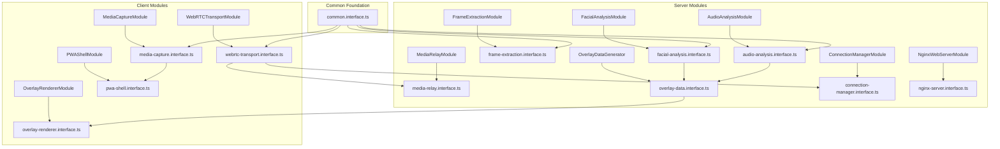

# Design Document

## Overview

This design establishes proper modular interface architecture that follows universal software engineering principles. The architecture implements explicit interface contracts, minimal dependencies, and clear module boundaries that support independent development and maintainable code organization.

## Architecture

The modular interface architecture implements:

1. **Direct Interface Imports**: Modules import specific interfaces using explicit paths
2. **Single-Purpose Interfaces**: Each interface file serves exactly one module
3. **Minimal Contracts**: Interfaces expose only essential methods and types
4. **Clear Dependencies**: Import statements reveal actual module dependencies
5. **Independent Evolution**: Modules can change without affecting unrelated components

### Module Dependency Graph



## Components and Interfaces

### Interface Organization

Each interface file follows the naming pattern `{module-name}.interface.ts` and contains:

- **Primary Interface**: Main contract for the module
- **Configuration Types**: Module-specific configuration objects
- **Result Types**: Module-specific response and result structures
- **Error Types**: Module-specific error definitions

### Dependency Hierarchy

1. **Foundation Layer**: `common.interface.ts` provides shared types
2. **Core Interfaces**: Module-specific contracts that may depend on common types
3. **Composite Interfaces**: Higher-level contracts that combine multiple core interfaces
4. **Module Implementations**: Concrete classes that implement their respective interfaces

### Import Pattern Standards

```typescript
// Explicit, minimal imports - each module imports only what it needs
import { MediaCaptureModule, CaptureConfig } from '../shared/interfaces/media-capture.interface';
import { EmotionScore, BoundingBox } from '../shared/interfaces/common.interface';
```

## Data Models

### Interface Contract Structure

Each interface file follows this structure:

```typescript
// Module-specific imports only
import { CommonType1, CommonType2 } from './common.interface';

// Primary module interface
export interface ModuleNameModule {
  // Minimal, essential methods only
}

// Module-specific configuration
export interface ModuleNameConfig {
  // Configuration properties
}

// Module-specific results
export interface ModuleNameResult {
  // Result properties
}

// Module-specific errors
export interface ModuleNameError extends ModuleError {
  // Error-specific properties
}
```

### Common Interface Refinement

The `common.interface.ts` file will be refined to contain only truly shared types:

- **Base Types**: `EmotionScore`, `BoundingBox`, `Point2D`
- **Error Foundation**: `ModuleError` base interface
- **Response Wrapper**: `ApiResponse<T>` generic response structure
- **Quality Metrics**: Shared quality and performance types

### Module-Specific Interface Contracts

Each module interface will be streamlined to expose only essential functionality:

1. **MediaCaptureModule**: Device access and stream management
2. **WebRTCTransportModule**: Peer connection and data transmission
3. **FrameExtractionModule**: Video/audio frame processing
4. **FacialAnalysisModule**: Facial emotion recognition
5. **AudioAnalysisModule**: Voice emotion recognition
6. **OverlayDataGenerator**: Emotion data fusion
7. **OverlayRendererModule**: Client-side overlay rendering
8. **ConnectionManagerModule**: Session lifecycle management
9. **PWAShellModule**: Progressive web app features
10. **NginxWebServerModule**: Web server configuration
11. **MediaRelayModule**: Scalable media routing

## Error Handling

### Interface-Level Error Management

Each interface defines its own error types that extend the base `ModuleError`:

```typescript
export interface ModuleSpecificError extends ModuleError {
  type: 'SpecificErrorType1' | 'SpecificErrorType2';
  moduleSpecificProperty?: string;
}
```

### Error Isolation

Errors remain isolated to their respective modules, preventing error type pollution across the system. Modules handle their own error types and only expose necessary error information through their interfaces.

## Testing Strategy

### Interface Contract Testing

Each interface will have contract tests that verify:

1. **Method Signatures**: Correct parameter and return types
2. **Error Handling**: Proper error type definitions and handling
3. **Configuration Validation**: Valid configuration object structures
4. **Result Consistency**: Consistent result object formats

### Module Isolation Testing

With explicit imports, each module can be tested in complete isolation:

```typescript
// Test can import only what the module actually uses
import { MediaCaptureModule } from '../shared/interfaces/media-capture.interface';
import { EmotionScore } from '../shared/interfaces/common.interface';

// No need to mock unrelated interfaces
```

### Dependency Verification Testing

Automated tests will verify that:

1. No module imports from a central index file
2. Each module imports only the interfaces it actually uses
3. Interface changes affect only modules that explicitly import them
4. No circular dependencies exist between interfaces

### Build-Time Validation

The build system will enforce:

1. **Import Path Validation**: Ensure all imports use explicit paths
2. **Unused Import Detection**: Identify and remove unused interface imports
3. **Dependency Graph Analysis**: Verify clean dependency relationships
4. **Tree-Shaking Verification**: Confirm unused interfaces are excluded from bundles

## Implementation Approach

### Phase 1: Interface Cleanup

1. Remove central `index.ts` export hub
2. Refine `common.interface.ts` to contain only shared types
3. Ensure each module interface contains only essential contracts

### Phase 2: Import Refactoring

1. Update all module imports to use explicit paths
2. Remove unused interface imports
3. Verify each module imports only required interfaces

### Phase 3: Build System Updates

1. Update TypeScript path mappings if necessary
2. Configure build tools for proper tree-shaking
3. Add linting rules to prevent central hub imports

### Phase 4: Documentation and Validation

1. Update documentation to reflect new import patterns
2. Add automated tests for dependency validation
3. Create developer guidelines for interface management

This design ensures that the interface architecture follows proper modular design principles, supports independent module development, and maintains clear, minimal contracts between system components.
