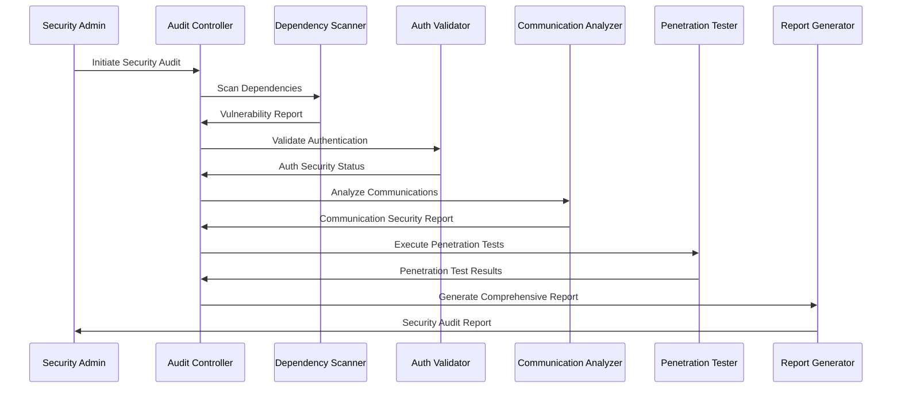

# Security Audit Design Document

## Overview

This design document outlines a comprehensive security audit framework for the emotion recognition PWA system. The audit leverages the latest security intelligence from Context7 to identify vulnerabilities, validate security controls, and ensure compliance with modern security standards. The design incorporates automated scanning, manual testing, and continuous monitoring approaches.

## Architecture

### Audit Framework Components

```mermaid
graph TB
    A[Security Audit Controller] --> B[Dependency Scanner]
    A --> C[Authentication Validator]
    A --> D[Communication Security Analyzer]
    A --> E[Data Protection Auditor]
    A --> F[Infrastructure Security Scanner]
    A --> G[Penetration Testing Engine]
    A --> H[Architecture Review Module]
    A --> I[Monitoring & Response System]

    B --> B1[NPM Audit]
    B --> B2[Context7 Vulnerability DB]
    B --> B3[OWASP Dependency Check]

    C --> C1[Socket.IO Auth Validator]
    C --> C2[WebRTC Certificate Checker]
    C --> C3[JWT Token Analyzer]

    D --> D1[TLS/DTLS Validator]
    D --> D2[SRTP Configuration Checker]
    D --> D3[Protocol Security Analyzer]

    E --> E1[Data Flow Mapper]
    E --> E2[Privacy Control Validator]
    E --> E3[Encryption Verifier]

    F --> F1[Docker Security Scanner]
    F --> F2[Environment Config Auditor]
    F --> F3[Network Policy Validator]

    G --> G1[Fuzzing Test Suite]
    G --> G2[Injection Attack Simulator]
    G --> G3[DoS Resilience Tester]

    H --> H1[Code Security Analyzer]
    H --> H2[Architecture Pattern Validator]
    H --> H3[Security Header Checker]

    I --> I1[Security Event Monitor]
    I --> I2[Incident Response Tracker]
    I --> I3[Compliance Dashboard]
```



### Security Audit Workflow



## Components and Interfaces

### 1. Dependency Scanner Module

**Purpose:** Scan all project dependencies for known vulnerabilities using Context7 intelligence.

**Key Features:**

- Integration with Context7 vulnerability database
- NPM audit integration with custom rules
- Socket.IO specific vulnerability checks (CVE-2022-41940, CVE-2022-2421)
- Express.js security validation (path traversal, open redirect fixes)
- Mediasoup dependency analysis with fuzzing validation
- Automated dependency update recommendations

**Interface:**

```typescript
interface DependencyScanner {
  scanPackageFiles(paths: string[]): Promise<VulnerabilityReport>;
  checkSocketIOSecurity(): Promise<SocketIOSecurityReport>;
  validateExpressSecurity(): Promise<ExpressSecurityReport>;
  analyzeMediasoupDependencies(): Promise<MediasoupSecurityReport>;
  generateUpdateRecommendations(): Promise<UpdateRecommendation[]>;
}
```

### 2. Authentication Validator Module

**Purpose:** Validate authentication and authorization mechanisms across all system components.

**Key Features:**

- Socket.IO auth payload validation
- WebRTC DTLS certificate verification
- JWT token security analysis
- Session management validation
- CORS policy verification
- Multi-factor authentication checks

**Interface:**

```typescript
interface AuthenticationValidator {
  validateSocketIOAuth(): Promise<AuthValidationResult>;
  checkWebRTCCertificates(): Promise<CertificateValidationResult>;
  analyzeJWTSecurity(): Promise<JWTSecurityReport>;
  validateSessionManagement(): Promise<SessionSecurityReport>;
  checkCORSPolicies(): Promise<CORSValidationResult>;
}
```

### 3. Communication Security Analyzer

**Purpose:** Analyze and validate secure communication channels and protocols.

**Key Features:**

- TLS/DTLS configuration validation
- SRTP encryption verification
- WebSocket security analysis
- Protocol-specific security checks
- Certificate chain validation
- Cipher suite analysis

**Interface:**

```typescript
interface CommunicationSecurityAnalyzer {
  validateTLSConfiguration(): Promise<TLSSecurityReport>;
  checkSRTPEncryption(): Promise<SRTPValidationResult>;
  analyzeWebSocketSecurity(): Promise<WebSocketSecurityReport>;
  validateCertificateChains(): Promise<CertificateChainReport>;
  analyzeCipherSuites(): Promise<CipherSuiteReport>;
}
```

### 4. Data Protection Auditor

**Purpose:** Ensure data protection and privacy compliance throughout the system.

**Key Features:**

- Data flow mapping and analysis
- Privacy control validation
- Encryption at rest verification
- Data minimization compliance
- Consent management validation
- PII detection and protection

**Interface:**

```typescript
interface DataProtectionAuditor {
  mapDataFlows(): Promise<DataFlowMap>;
  validatePrivacyControls(): Promise<PrivacyComplianceReport>;
  checkEncryptionAtRest(): Promise<EncryptionValidationResult>;
  validateConsentManagement(): Promise<ConsentValidationReport>;
  detectPIIExposure(): Promise<PIIExposureReport>;
}
```

### 5. Infrastructure Security Scanner

**Purpose:** Validate infrastructure security configurations and deployment practices.

**Key Features:**

- Docker container security scanning
- Environment configuration validation
- Network policy analysis
- Privilege escalation detection
- Resource access control validation
- Backup security verification

**Interface:**

```typescript
interface InfrastructureSecurityScanner {
  scanDockerContainers(): Promise<ContainerSecurityReport>;
  validateEnvironmentConfig(): Promise<EnvironmentSecurityReport>;
  analyzeNetworkPolicies(): Promise<NetworkSecurityReport>;
  checkPrivilegeEscalation(): Promise<PrivilegeEscalationReport>;
  validateBackupSecurity(): Promise<BackupSecurityReport>;
}
```

### 6. Penetration Testing Engine

**Purpose:** Perform automated and manual penetration testing to identify vulnerabilities.

**Key Features:**

- Fuzzing test suite for WebRTC, SCTP, HTTP protocols
- Injection attack simulation (SQL, NoSQL, Command)
- DoS resilience testing
- Man-in-the-middle attack simulation
- Social engineering assessment
- API security testing

**Interface:**

```typescript
interface PenetrationTestingEngine {
  executeFuzzingTests(): Promise<FuzzingTestReport>;
  simulateInjectionAttacks(): Promise<InjectionTestReport>;
  testDoSResilience(): Promise<DoSTestReport>;
  simulateMITMAttacks(): Promise<MITMTestReport>;
  assessSocialEngineering(): Promise<SocialEngineeringReport>;
}
```

## Data Models

### Vulnerability Report Model

```typescript
interface VulnerabilityReport {
  id: string;
  timestamp: Date;
  severity: 'LOW' | 'MEDIUM' | 'HIGH' | 'CRITICAL';
  category: string;
  description: string;
  affectedComponents: string[];
  cveIds: string[];
  remediation: RemediationStep[];
  context7Intelligence: Context7VulnerabilityData;
}

interface Context7VulnerabilityData {
  libraryId: string;
  trustScore: number;
  codeSnippets: number;
  securityAdvisories: SecurityAdvisory[];
  recommendedVersions: string[];
}
```

### Security Test Result Model

```typescript
interface SecurityTestResult {
  testId: string;
  testName: string;
  category: SecurityTestCategory;
  status: 'PASS' | 'FAIL' | 'WARNING';
  findings: SecurityFinding[];
  recommendations: string[];
  riskLevel: RiskLevel;
  executionTime: number;
}

interface SecurityFinding {
  id: string;
  title: string;
  description: string;
  severity: SeverityLevel;
  location: string;
  evidence: Evidence[];
  remediation: string;
}
```

### Compliance Status Model

```typescript
interface ComplianceStatus {
  framework: string; // OWASP, NIST, ISO27001, etc.
  overallScore: number;
  controlsAssessed: number;
  controlsPassed: number;
  controlsFailed: number;
  controlsWarning: number;
  detailedResults: ComplianceControlResult[];
}

interface ComplianceControlResult {
  controlId: string;
  controlName: string;
  status: ComplianceStatus;
  evidence: string[];
  gaps: string[];
  recommendations: string[];
}
```

## Error Handling

### Error Classification

- **Critical Security Errors:** Immediate system shutdown and alert
- **High Priority Errors:** Alert security team and log for immediate review
- **Medium Priority Errors:** Log and schedule for review within 24 hours
- **Low Priority Errors:** Log for periodic review

### Error Response Strategy

```typescript
interface SecurityErrorHandler {
  handleCriticalError(error: SecurityError): Promise<void>;
  handleHighPriorityError(error: SecurityError): Promise<void>;
  handleMediumPriorityError(error: SecurityError): Promise<void>;
  handleLowPriorityError(error: SecurityError): Promise<void>;
  escalateToSecurityTeam(error: SecurityError): Promise<void>;
}
```

### Incident Response Integration

- Automatic ticket creation for security incidents
- Integration with SIEM systems
- Notification to security team via multiple channels
- Automated containment procedures for critical vulnerabilities

## Testing Strategy

### Automated Security Testing

1. **Continuous Dependency Scanning**
   - Daily scans of all package.json files
   - Integration with CI/CD pipeline
   - Automated pull request creation for security updates

2. **Protocol Security Testing**
   - WebRTC connection security validation
   - Socket.IO authentication testing
   - HTTPS/WSS certificate validation

3. **API Security Testing**
   - Authentication bypass attempts
   - Authorization validation
   - Input validation testing
   - Rate limiting verification

### Manual Security Testing

1. **Architecture Review**
   - Security design pattern validation
   - Threat modeling exercises
   - Code review for security anti-patterns

2. **Penetration Testing**
   - External network penetration testing
   - Internal network security assessment
   - Social engineering simulation
   - Physical security assessment

### Performance Impact Testing

1. **Security Overhead Analysis**
   - Measure performance impact of security controls
   - Optimize security implementations
   - Balance security and performance requirements

2. **Load Testing with Security**
   - Test security controls under load
   - Validate DoS protection mechanisms
   - Ensure security doesn't degrade under stress

### Context7 Integration Testing

1. **Vulnerability Intelligence Validation**
   - Test Context7 API integration
   - Validate vulnerability data accuracy
   - Test automated remediation suggestions

2. **Security Best Practices Verification**
   - Validate implementation against Context7 recommendations
   - Test security code snippets and configurations
   - Verify compliance with latest security standards

## Security Metrics and KPIs

### Vulnerability Metrics

- Mean Time to Detection (MTTD)
- Mean Time to Response (MTTR)
- Vulnerability density per component
- Critical vulnerability exposure time

### Compliance Metrics

- Compliance score by framework
- Control implementation percentage
- Audit finding resolution time
- Security policy adherence rate

### Operational Metrics

- Security test coverage percentage
- Automated vs manual test ratio
- False positive rate
- Security team response time

## Reporting and Documentation

### Executive Dashboard

- High-level security posture overview
- Risk trend analysis
- Compliance status summary
- Key security metrics

### Technical Reports

- Detailed vulnerability assessments
- Penetration testing results
- Architecture security analysis
- Remediation progress tracking

### Compliance Reports

- Framework-specific compliance status
- Control implementation evidence
- Gap analysis and remediation plans
- Audit trail documentation
