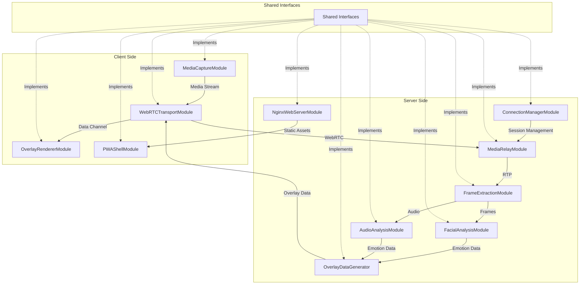
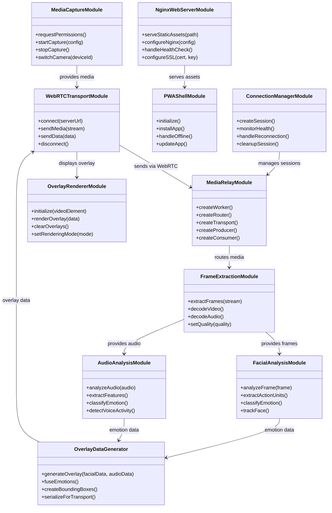
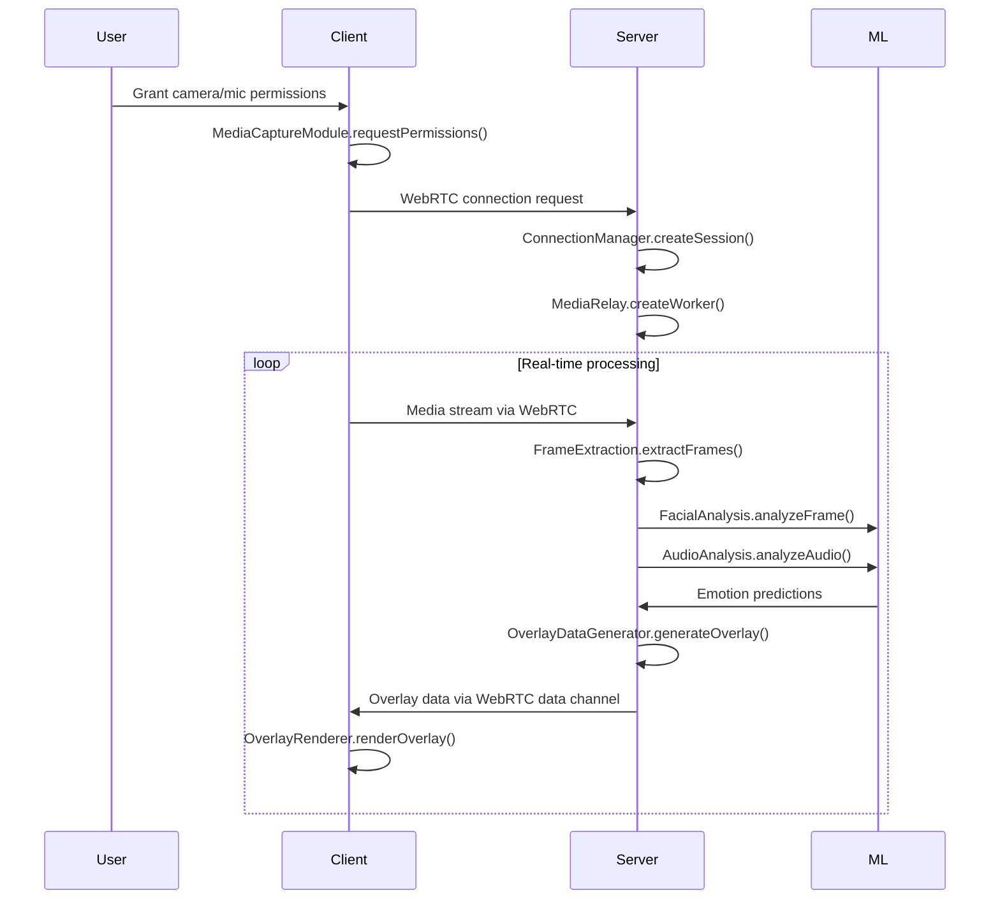

# Emotion Recognition PWA - Architecture Documentation

## System Overview

This document provides comprehensive UML diagrams and architectural documentation for the emotion recognition PWA framework, including module relationships, API contracts, and user story mappings.

## 🏗️ System Architecture Diagram



## 📊 Module Relationship Diagram



## 🔗 API Contract Diagram



## 👥 User Stories & Interface Justification

### **User Story 1: "As a user, I want to see my emotions detected in real-time"**

**Why MediaCaptureModule is necessary:**

- **Interface**: `MediaCaptureModule` provides `startCapture()` and `requestPermissions()`
- **Justification**: Users need camera/microphone access to capture their facial expressions and voice
- **API Contract**: Returns `MediaStream` with configurable quality settings

**Why WebRTCTransportModule is necessary:**

- **Interface**: `connect()` and `sendMedia()` methods
- **Justification**: Real-time requires low-latency WebRTC transport instead of HTTP polling
- **API Contract**: Establishes peer-to-peer connection with sub-500ms latency

### **User Story 2: "As a user, I want accurate emotion detection"**

**Why FacialAnalysisModule is necessary:**

- **Interface**: `analyzeFrame()` and `classifyEmotion()`
- **Justification**: OpenFace integration provides 45 Action Units for precise emotion detection
- **API Contract**: Returns emotion labels with confidence scores

**Why AudioAnalysisModule is necessary:**

- **Interface**: `analyzeAudio()` and `extractFeatures()`
- **Justification**: Voice tone analysis complements facial expressions for accuracy
- **API Contract**: Returns audio emotion predictions synchronized with video

### **User Story 3: "As a user, I want the app to work on my phone"**

**Why PWAShellModule is necessary:**

- **Interface**: `installApp()` and `handleOffline()`
- **Justification**: PWA enables app-like experience without app store installation
- **API Contract**: Provides offline functionality and push notifications

**Why NginxWebServerModule is necessary:**

- **Interface**: `serveStaticAssets()` and `configureSSL()`
- **Justification**: Serves PWA assets efficiently with HTTPS for camera access
- **API Contract**: Handles static file serving with proper caching

### **User Story 4: "As a developer, I want to scale the system"**

**Why ConnectionManagerModule is necessary:**

- **Interface**: `createSession()` and `monitorHealth()`
- **Justification**: Manages 100+ concurrent WebRTC connections efficiently
- **API Contract**: Provides session lifecycle management and load balancing

**Why MediaRelayModule is necessary:**

- **Interface**: `createWorker()` and `createRouter()`
- **Justification**: Mediasoup enables horizontal scaling of media processing
- **API Contract**: Routes media streams across multiple server instances

## 🎯 Gurki-Style User Stories

### **Core User Value Stories**

```gherkin
Feature: Real-time Emotion Recognition
  As a video call participant
  I want to see emotion overlays on my face
  So that I can better understand my emotional expressions

  Scenario: Successful emotion detection
    Given I have granted camera permissions
    When I smile at the camera
    Then I should see a "happy" overlay with >80% confidence
    And the overlay should update within 500ms

  Scenario: Cross-platform compatibility
    Given I'm using an iPhone Safari browser
    When I install the PWA
    Then emotion detection should work offline
    And camera access should be seamless

  Scenario: High concurrent usage
    Given 100 users are connected simultaneously
    When each user enables emotion detection
    Then the system should maintain <500ms latency
    And emotion accuracy should remain >85%
```

### **Technical Implementation Stories**

```gherkin
Feature: Modular Architecture
  As a system architect
  I want clearly defined module interfaces
  So that components can be developed and tested independently

  Scenario: Interface contract validation
    Given the MediaCaptureModule interface
    When implementing startCapture(config)
    Then it must return a MediaStream object
    And handle all permission error cases
    And support device switching

  Scenario: API versioning
    Given a shared interface
    When the emotion detection algorithm changes
    Then the interface should remain backward compatible
    And new features should be additive only
```

## 📋 Interface Necessity Matrix

| Module            | User Need        | Technical Need     | Business Value          |
| ----------------- | ---------------- | ------------------ | ----------------------- |
| MediaCapture      | Camera access    | Stream input       | Core functionality      |
| WebRTCTransport   | Real-time        | Low latency        | User experience         |
| FacialAnalysis    | Emotion accuracy | ML processing      | Product differentiation |
| AudioAnalysis     | Voice emotion    | Multi-modal        | Enhanced accuracy       |
| OverlayRenderer   | Visual feedback  | Canvas rendering   | User engagement         |
| PWAShell          | Mobile access    | Offline capability | Market reach            |
| ConnectionManager | Scalability      | Session management | Growth support          |
| MediaRelay        | Performance      | Media routing      | Infrastructure          |
| FrameExtraction   | Processing       | Video decoding     | Pipeline efficiency     |
| OverlayGenerator  | Data fusion      | Emotion synthesis  | Accuracy improvement    |
| NginxWebServer    | Deployment       | Static serving     | Production readiness    |

## 🔧 API Design Principles

1. **Single Responsibility**: Each module has one clear purpose
2. **Interface Segregation**: Clients depend only on methods they use
3. **Dependency Inversion**: High-level modules don't depend on low-level implementations
4. **Open/Closed**: Interfaces are open for extension, closed for modification
5. **Version Compatibility**: All interfaces include version numbers for evolution

This architecture ensures the emotion recognition PWA can scale from prototype to production while maintaining code quality and user experience.
