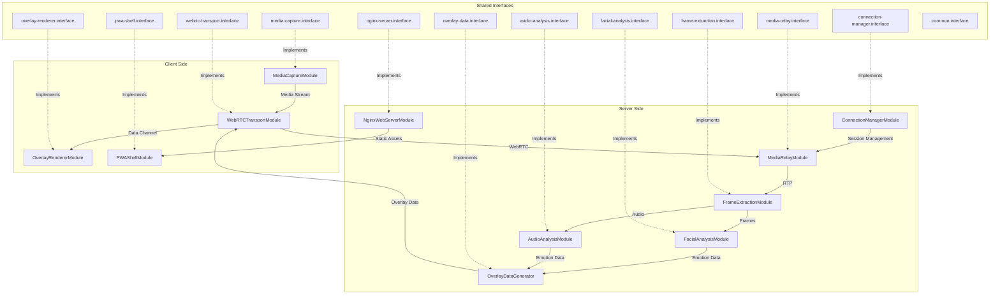
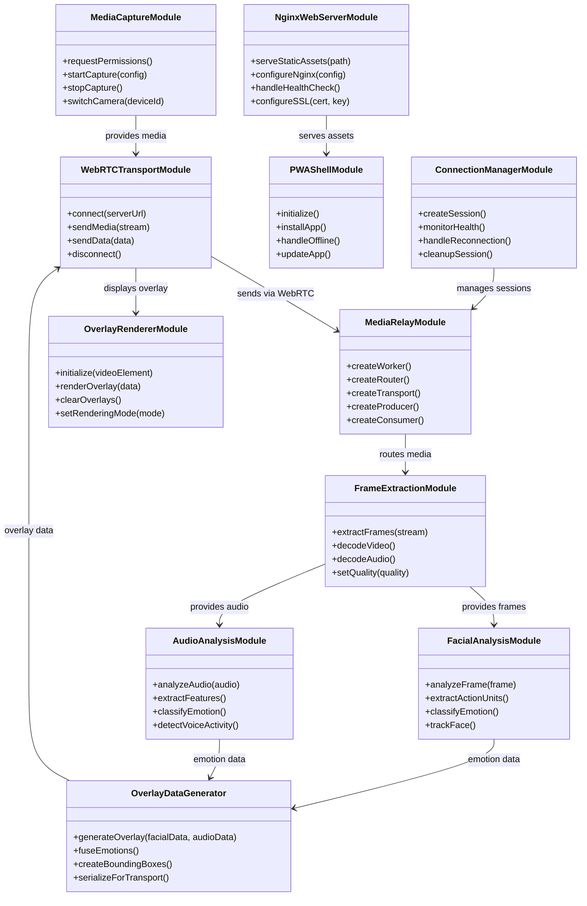
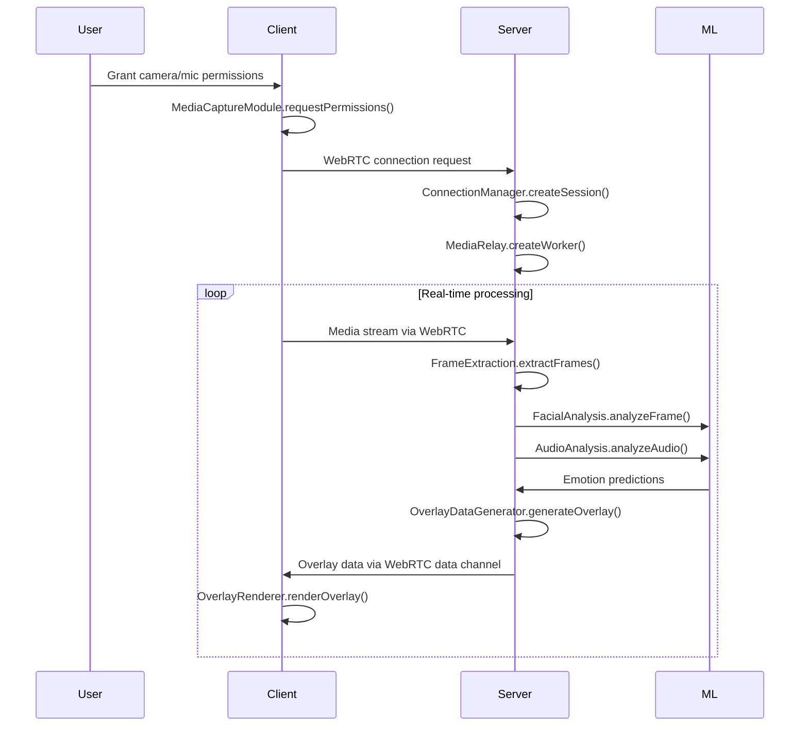
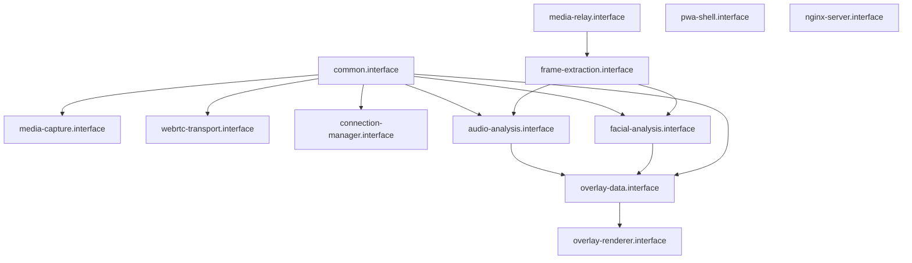

# Emotion Recognition PWA - Architecture Documentation

## System Overview

This document defines the low-level architecture for the emotion recognition PWA system. It assumes the reader has access to the requirements specification and high-level design documents that establish the problem domain and solution approach.

The architecture addresses a fundamental question: **How do we decompose a real-time emotion recognition system into independent, parallel-developable modules while ensuring they work together seamlessly?**

## Module Requirements

### MediaCaptureModule

**Why required**: Users must grant device permissions and configure media capture. Browser APIs vary across platforms and devices.

**What it must provide**:

- Device permission management
- Media stream configuration and control
- Device enumeration and selection
- Stream quality adaptation

### WebRTCTransportModule

**Why required**: Real-time emotion recognition requires sub-500ms latency. HTTP polling cannot achieve this performance.

**What it must provide**:

- Real-time media stream transport
- Data channel communication for overlay information
- Connection state management and recovery
- Network quality adaptation

### OverlayRendererModule

**Why required**: Users need immediate visual feedback about detected emotions without disrupting video viewing.

**What it must provide**:

- Real-time overlay rendering on video streams
- Multiple face tracking and display
- Overlay expiration and cleanup
- Performance-optimized graphics rendering

### PWAShellModule

**Why required**: Users expect native app-like functionality on mobile devices without app store installation.

**What it must provide**:

- Progressive Web App installation and management
- Offline functionality and caching
- Cross-device responsive behavior
- Native app-like user experience

### MediaRelayModule

**Why required**: Direct peer-to-peer connections cannot scale beyond small groups. System requires 1000+ concurrent users.

**What it must provide**:

- Scalable media stream routing
- Load balancing across processing resources
- Session management for concurrent connections
- Resource allocation and cleanup

### FrameExtractionModule

**Why required**: AI analysis requires standardized frame formats, but media streams arrive in various codecs and formats.

**What it must provide**:

- Video frame extraction and format conversion
- Audio chunk extraction with timing synchronization
- Quality adaptation for processing requirements
- Decoder management for multiple formats

### FacialAnalysisModule

**Why required**: Facial expressions contain primary emotion information that users expect to see analyzed.

**What it must provide**:

- Face detection and tracking across frames
- Facial landmark extraction
- Emotion classification with confidence scores
- Multiple face processing capability

### AudioAnalysisModule

**Why required**: Voice carries significant emotional information that complements facial analysis for improved accuracy.

**What it must provide**:

- Speech detection and voice activity analysis
- Vocal feature extraction for emotion analysis
- Audio emotion classification with confidence scores
- Multi-speaker processing capability

### OverlayDataGenerator

**Why required**: Multiple analysis modules produce different data formats and timing. Clients require consistent, synchronized overlay information.

**What it must provide**:

- Multi-modal emotion data fusion
- Temporal synchronization of analysis results
- Unified overlay data format for client rendering
- Confidence weighting and conflict resolution

### ConnectionManagerModule

**Why required**: Large-scale real-time systems require centralized resource coordination and health monitoring for 1000+ concurrent users.

**What it must provide**:

- Session creation, monitoring, and cleanup
- Resource allocation and load balancing
- System health monitoring and reporting
- Performance optimization and scaling decisions

### NginxWebServerModule

**Why required**: PWA applications require efficient static asset delivery with SSL security and high concurrent load handling.

**What it must provide**:

- Static asset serving with optimal caching
- SSL termination and security headers
- Load balancing across server instances
- Performance monitoring and optimization

## 🏗️ System Architecture Diagram

The following diagram illustrates how the eleven modules connect and interact to deliver real-time emotion recognition functionality. It shows the data flow from user input through processing to visual output, demonstrating the modular boundaries and interface relationships.



## Information Flow Examples

### Primary Usage Flow: User Enables Emotion Recognition

**Step 1 - Initial Setup**:

- User opens PWA → NginxWebServerModule serves application assets → PWAShellModule initializes application shell
- PWAShellModule requests device access → MediaCaptureModule requests camera/microphone permissions
- User grants permissions → MediaCaptureModule enumerates available devices and creates media stream

**Step 2 - Connection Establishment**:

- MediaCaptureModule provides media stream → WebRTCTransportModule establishes connection with server
- WebRTCTransportModule sends connection request → ConnectionManagerModule creates new session
- ConnectionManagerModule allocates resources → MediaRelayModule creates worker and transport for session

**Step 3 - Media Processing**:

- WebRTCTransportModule streams media → MediaRelayModule routes to FrameExtractionModule
- FrameExtractionModule extracts video frames → FacialAnalysisModule analyzes for faces and emotions
- FrameExtractionModule extracts audio chunks → AudioAnalysisModule analyzes for voice emotions
- Both analysis modules send results → OverlayDataGenerator combines into unified overlay data

**Step 4 - Result Display**:

- OverlayDataGenerator sends overlay data → WebRTCTransportModule receives via data channel
- WebRTCTransportModule provides overlay data → OverlayRendererModule renders on video stream
- User sees emotion overlays displayed in real-time on their video feed

### Secondary Usage Flow: User Switches Camera

**Step 1 - Device Change**:

- User selects different camera → MediaCaptureModule stops current stream
- MediaCaptureModule starts new stream with selected device → WebRTCTransportModule updates media tracks

**Step 2 - Processing Continuity**:

- New media stream flows through same processing pipeline → No server-side changes required
- Analysis modules continue processing with new video source → Overlay rendering continues seamlessly

### Error Recovery Flow: Connection Failure

**Step 1 - Failure Detection**:

- Network interruption occurs → WebRTCTransportModule detects connection failure
- WebRTCTransportModule attempts reconnection → ConnectionManagerModule monitors session health

**Step 2 - Recovery Process**:

- ConnectionManagerModule initiates recovery → MediaRelayModule maintains session state
- WebRTCTransportModule re-establishes connection → Media processing resumes automatically
- OverlayRendererModule continues with cached data until new results arrive

This architecture ensures that each module handles its specific responsibility while maintaining clear information flow paths for reliable, scalable emotion recognition functionality.

## 📊 Module Relationship Diagram

The following class diagram illustrates the public interface contracts that each module must implement. It shows the essential methods required for each module to fulfill its architectural responsibilities and the directional relationships that define how data flows between modules during system operation.



### Method Necessity and Functionality

Each module's public methods represent the minimum interface required to fulfill the system's functional requirements. The following explains why each method is architecturally necessary:

#### **Client-Side Module Methods**

**MediaCaptureModule**:

- `requestPermissions()`: Required to handle browser security model - user consent must be obtained before device access
- `startCapture(config)`: Necessary to initiate media streams with specific quality parameters for processing requirements
- `stopCapture()`: Essential for resource cleanup and user privacy - streams must be terminable
- `switchCamera(deviceId)`: Required for user experience - users expect to select between available cameras

**WebRTCTransportModule**:

- `connect(serverUrl)`: Necessary to establish real-time communication channel with processing backend
- `sendMedia(stream)`: Required to transmit captured media for server-side analysis
- `sendData(data)`: Essential for bidirectional communication - control messages and overlay data
- `disconnect()`: Required for proper connection lifecycle management and resource cleanup

**OverlayRendererModule**:

- `initialize(videoElement)`: Necessary to establish rendering context on user's video display
- `renderOverlay(data)`: Core functionality - displays emotion analysis results to user
- `clearOverlays()`: Required for visual state management - removes outdated emotion indicators
- `setRenderingMode(mode)`: Necessary for performance optimization across different device capabilities

**PWAShellModule**:

- `initialize()`: Required to set up Progressive Web App functionality and service workers
- `installApp()`: Necessary for native app-like experience - enables home screen installation
- `handleOffline()`: Essential for PWA compliance - application must function without network
- `updateApp()`: Required for application lifecycle - users need access to latest features

#### **Server-Side Module Methods**

**MediaRelayModule**:

- `createWorker()`: Necessary for horizontal scaling - distributes processing load across multiple instances
- `createRouter()`: Required for media routing - directs streams to appropriate processing modules
- `createTransport()`: Essential for WebRTC connection management - handles client communication
- `createProducer()`: Required to receive media streams from clients
- `createConsumer()`: Necessary to distribute processed results back to clients

**FrameExtractionModule**:

- `extractFrames(stream)`: Core functionality - converts media streams into processable frame data
- `decodeVideo()`: Required to handle various video codecs and formats from different clients
- `decodeAudio()`: Necessary for audio processing pipeline - extracts audio data for emotion analysis
- `setQuality(quality)`: Essential for performance management - adapts processing load to system capacity

**FacialAnalysisModule**:

- `analyzeFrame(frame)`: Core functionality - performs emotion detection on video frames
- `extractActionUnits()`: Required for accurate emotion classification - maps facial muscle movements
- `classifyEmotion()`: Necessary to convert technical analysis into user-understandable emotion labels
- `trackFace()`: Essential for multi-face scenarios - maintains identity across frame sequences

**AudioAnalysisModule**:

- `analyzeAudio(audio)`: Core functionality - performs emotion detection on audio streams
- `extractFeatures()`: Required for machine learning pipeline - converts audio to processable features
- `classifyEmotion()`: Necessary to determine emotional content from voice characteristics
- `detectVoiceActivity()`: Essential for processing efficiency - only analyzes segments containing speech

**OverlayDataGenerator**:

- `generateOverlay(facialData, audioData)`: Core functionality - combines multiple emotion sources
- `fuseEmotions()`: Required for accuracy - resolves conflicts between facial and audio emotion detection
- `createBoundingBoxes()`: Necessary for visual presentation - defines where overlays appear on video
- `serializeForTransport()`: Essential for network efficiency - formats data for client transmission

**ConnectionManagerModule**:

- `createSession()`: Required for user session lifecycle - manages individual user connections
- `monitorHealth()`: Necessary for system reliability - detects and responds to performance issues
- `handleReconnection()`: Essential for user experience - maintains sessions during network interruptions
- `cleanupSession()`: Required for resource management - prevents memory leaks and resource exhaustion

**NginxWebServerModule**:

- `serveStaticAssets(path)`: Core functionality - delivers PWA application files to users
- `configureNginx(config)`: Required for deployment flexibility - adapts to different hosting environments
- `handleHealthCheck()`: Necessary for load balancing - enables automatic failover and scaling
- `configureSSL(cert, key)`: Essential for security - HTTPS required for camera/microphone access

### Interface Design Rationale

The method signatures represent the minimum viable interface for each module's responsibility. Each method serves a specific architectural purpose:

- **Lifecycle Methods** (initialize, connect, cleanup): Manage resource allocation and system state
- **Core Processing Methods** (analyze, extract, generate): Implement the module's primary business logic
- **Configuration Methods** (setQuality, setMode): Enable system optimization and adaptation
- **Communication Methods** (send, receive, serialize): Handle data exchange between modules

This interface design ensures that modules can be developed independently while maintaining system integration through well-defined contracts.

## 🔗 API Contract Diagram

The following sequence diagram illustrates the temporal flow of method calls and data exchange during a complete emotion recognition session. It demonstrates how the static module relationships translate into dynamic runtime interactions, showing the chronological sequence of API calls required to deliver end-to-end functionality.



### What This Diagram Conveys

The sequence diagram reveals several critical architectural patterns and timing requirements:

#### **Initialization Phase**

The diagram shows that system startup follows a specific order:

1. **User Interaction**: Human user initiates the process by granting device permissions
2. **Client Setup**: MediaCaptureModule handles browser security requirements before any media processing
3. **Server Preparation**: ConnectionManager and MediaRelay modules establish infrastructure before receiving media

This sequence is architecturally necessary because each step creates prerequisites for the next - media cannot be captured without permissions, and server resources must be allocated before media arrives.

#### **Real-Time Processing Loop**

The core processing cycle demonstrates the system's real-time architecture:

- **Continuous Media Flow**: Client streams media continuously, not in discrete requests
- **Parallel Processing**: Facial and audio analysis occur simultaneously on the server
- **Bidirectional Communication**: Data flows both directions - media to server, overlay data to client
- **Immediate Feedback**: Overlay rendering happens immediately upon receiving processed data

#### **Temporal Dependencies**

The diagram reveals critical timing relationships:

- **Sequential Setup**: Initial setup steps must complete in order
- **Concurrent Analysis**: Facial and audio processing can happen in parallel for performance
- **Synchronous Overlay Generation**: Emotion fusion waits for both analysis results
- **Asynchronous Rendering**: Client rendering doesn't block server processing

#### **System Boundaries**

The participant separation illustrates architectural boundaries:

- **User**: Represents human interaction points and permission requirements
- **Client**: Encapsulates browser-based modules and user interface responsibilities
- **Server**: Contains media processing and business logic modules
- **ML**: Represents external machine learning services and analysis engines

#### **Communication Patterns**

The message flows demonstrate different interaction patterns:

- **Request-Response**: Permission requests and session setup follow traditional patterns
- **Streaming**: Media transmission uses continuous data flow
- **Event-Driven**: Overlay updates trigger immediate rendering responses
- **Loop Processing**: Real-time analysis requires continuous processing cycles

#### **Error Handling Implications**

While not explicitly shown, the sequence implies error handling requirements:

- **Permission Failures**: Must be handled before any media processing begins
- **Connection Failures**: Could interrupt the real-time processing loop
- **Analysis Failures**: Should not stop the overall processing flow
- **Rendering Failures**: Should not affect server-side processing

This temporal view complements the static module relationships by showing how the system actually operates during runtime, revealing the dynamic behavior that emerges from the static architectural design.

## 📋 Requirements Traceability Matrix

This section maps each architectural component to specific functional requirements, ensuring complete traceability from business needs to technical implementation.

### **Client-Side Architecture Traceability**

| Module                    | Functional Requirements     | Business Rules                        | Architectural Rationale                                                     |
| ------------------------- | --------------------------- | ------------------------------------- | --------------------------------------------------------------------------- |
| **MediaCaptureModule**    | REQ-1 (Device Access)       | BR-1: Camera/mic permissions required | Provides secure device access with permission handling and device selection |
| **WebRTCTransportModule** | REQ-2 (Real-time Streaming) | BR-2: <500ms latency requirement      | Enables low-latency media streaming with automatic reconnection             |
| **OverlayRendererModule** | REQ-3 (Emotion Overlays)    | BR-3: Real-time visual feedback       | Renders emotion data as visual overlays with 2-second expiration            |
| **PWAShellModule**        | REQ-6 (Cross-platform)      | BR-4: Native app-like experience      | Provides PWA functionality for mobile, tablet, and desktop                  |

### **Server-Side Architecture Traceability**

| Module                      | Functional Requirements                              | Business Rules                      | Architectural Rationale                                      |
| --------------------------- | ---------------------------------------------------- | ----------------------------------- | ------------------------------------------------------------ |
| **MediaRelayModule**        | REQ-7 (Scalable WebRTC), REQ-8 (1000 users)          | BR-5: Concurrent session management | Mediasoup-based media routing for horizontal scaling         |
| **FrameExtractionModule**   | REQ-4 (Video Processing), REQ-5 (Audio Processing)   | BR-6: Frame-by-frame processing     | Decodes RTP streams for AI processing pipeline               |
| **FacialAnalysisModule**    | REQ-4 (OpenFace Processing)                          | BR-7: Facial landmark accuracy      | OpenFace integration for Action Unit extraction              |
| **AudioAnalysisModule**     | REQ-5 (Voice Emotion Analysis)                       | BR-8: Multi-modal emotion detection | AI model integration for voice emotion classification        |
| **OverlayDataGenerator**    | REQ-3 (Emotion Overlays), REQ-5 (Audio+Video Fusion) | BR-9: Emotion data fusion           | Combines facial and audio emotions into unified overlay data |
| **ConnectionManagerModule** | REQ-8 (1000 users), REQ-9 (Performance Monitoring)   | BR-10: Session lifecycle management | Manages WebRTC sessions with health monitoring               |
| **NginxWebServerModule**    | REQ-6 (Cross-platform), REQ-8 (Scalability)          | BR-11: Static asset delivery        | Serves PWA assets with SSL and load balancing                |

### **Business Rules Definition**

| Rule ID   | Business Rule                                                        | Architectural Impact                                            |
| --------- | -------------------------------------------------------------------- | --------------------------------------------------------------- |
| **BR-1**  | Camera and microphone access requires explicit user consent          | MediaCaptureModule must handle permission workflows             |
| **BR-2**  | End-to-end latency must not exceed 500ms for real-time experience    | WebRTC transport required instead of HTTP polling               |
| **BR-3**  | Emotion overlays must expire after 2 seconds to avoid stale data     | OverlayRendererModule implements time-based cleanup             |
| **BR-4**  | Application must work across mobile, tablet, and desktop platforms   | PWA architecture with responsive design required                |
| **BR-5**  | System must support 1000 concurrent users without degradation        | Mediasoup clustering and horizontal scaling architecture        |
| **BR-6**  | Video and audio must be processed frame-by-frame for accuracy        | Dedicated frame extraction module with FFmpeg integration       |
| **BR-7**  | Facial emotion detection must use industry-standard OpenFace toolkit | FacialAnalysisModule wraps OpenFace with standardized interface |
| **BR-8**  | Voice emotion analysis must complement facial analysis               | Separate AudioAnalysisModule with AI model integration          |
| **BR-9**  | Facial and voice emotions must be fused into unified results         | OverlayDataGenerator implements emotion fusion algorithms       |
| **BR-10** | WebRTC sessions must be managed with health monitoring               | ConnectionManagerModule provides session lifecycle management   |
| **BR-11** | PWA assets must be served with SSL and optimized caching             | Nginx-based web server with production-grade configuration      |

### **Functional Requirement Coverage Analysis**

| Requirement                       | Primary Module                            | Supporting Modules                                              | Coverage Status |
| --------------------------------- | ----------------------------------------- | --------------------------------------------------------------- | --------------- |
| **REQ-1: Device Access**          | MediaCaptureModule                        | PWAShellModule                                                  | ✅ Complete     |
| **REQ-2: Real-time Streaming**    | WebRTCTransportModule                     | MediaRelayModule, ConnectionManagerModule                       | ✅ Complete     |
| **REQ-3: Emotion Overlays**       | OverlayRendererModule                     | OverlayDataGenerator, FacialAnalysisModule, AudioAnalysisModule | ✅ Complete     |
| **REQ-4: Facial Analysis**        | FacialAnalysisModule                      | FrameExtractionModule                                           | ✅ Complete     |
| **REQ-5: Audio Analysis**         | AudioAnalysisModule                       | FrameExtractionModule                                           | ✅ Complete     |
| **REQ-6: Cross-platform PWA**     | PWAShellModule                            | NginxWebServerModule                                            | ✅ Complete     |
| **REQ-7: Scalable WebRTC**        | MediaRelayModule                          | ConnectionManagerModule                                         | ✅ Complete     |
| **REQ-8: 1000 User Scaling**      | MediaRelayModule, ConnectionManagerModule | All server modules                                              | ✅ Complete     |
| **REQ-9: Performance Monitoring** | ConnectionManagerModule                   | All modules (health reporting)                                  | ✅ Complete     |

## 🎯 Quality Attributes & Non-Functional Requirements

### **Performance Requirements**

| Quality Attribute    | Requirement               | Architectural Solution                               | Responsible Modules                       |
| -------------------- | ------------------------- | ---------------------------------------------------- | ----------------------------------------- |
| **Latency**          | <500ms end-to-end         | WebRTC transport + optimized processing pipeline     | WebRTCTransportModule, MediaRelayModule   |
| **Throughput**       | 1000 concurrent users     | Mediasoup clustering + horizontal scaling            | MediaRelayModule, ConnectionManagerModule |
| **Responsiveness**   | Real-time overlay updates | Canvas-based rendering with requestAnimationFrame    | OverlayRendererModule                     |
| **Processing Speed** | Frame-by-frame analysis   | Dedicated processing modules with parallel execution | FacialAnalysisModule, AudioAnalysisModule |

### **Reliability Requirements**

| Quality Attribute   | Requirement                | Architectural Solution                         | Responsible Modules                                             |
| ------------------- | -------------------------- | ---------------------------------------------- | --------------------------------------------------------------- |
| **Availability**    | 99.9% uptime               | Health monitoring + automatic recovery         | ConnectionManagerModule, All modules                            |
| **Fault Tolerance** | Graceful degradation       | Module isolation + error boundaries            | All modules (interface-based design)                            |
| **Recovery**        | Automatic reconnection     | WebRTC reconnection logic + session management | WebRTCTransportModule, ConnectionManagerModule                  |
| **Data Integrity**  | Accurate emotion detection | Multi-modal analysis + confidence scoring      | FacialAnalysisModule, AudioAnalysisModule, OverlayDataGenerator |

### **Scalability Requirements**

| Quality Attribute       | Requirement                      | Architectural Solution                | Responsible Modules                           |
| ----------------------- | -------------------------------- | ------------------------------------- | --------------------------------------------- |
| **Horizontal Scaling**  | Add servers for capacity         | Mediasoup worker clustering           | MediaRelayModule                              |
| **Load Distribution**   | Even load across servers         | Load balancing + session distribution | NginxWebServerModule, ConnectionManagerModule |
| **Resource Management** | Efficient memory/CPU usage       | Module-based resource isolation       | All modules                                   |
| **Connection Scaling**  | 1000+ concurrent WebRTC sessions | Mediasoup SFU architecture            | MediaRelayModule                              |

### **Security Requirements**

| Quality Attribute      | Requirement                 | Architectural Solution                   | Responsible Modules                     |
| ---------------------- | --------------------------- | ---------------------------------------- | --------------------------------------- |
| **Data Protection**    | Encrypted media streams     | DTLS/SRTP encryption in WebRTC           | WebRTCTransportModule, MediaRelayModule |
| **Access Control**     | User permission management  | Browser permission APIs + validation     | MediaCaptureModule                      |
| **Transport Security** | HTTPS/WSS only              | SSL termination + secure protocols       | NginxWebServerModule                    |
| **Privacy**            | No persistent media storage | Stream-only processing without recording | All processing modules                  |

### **Usability Requirements**

| Quality Attribute   | Requirement                              | Architectural Solution                                  | Responsible Modules                            |
| ------------------- | ---------------------------------------- | ------------------------------------------------------- | ---------------------------------------------- |
| **Cross-platform**  | Mobile, tablet, desktop support          | PWA architecture + responsive design                    | PWAShellModule                                 |
| **User Feedback**   | Real-time status indicators              | Connection state monitoring + UI updates                | ConnectionManagerModule, OverlayRendererModule |
| **Error Handling**  | Clear error messages + recovery guidance | Standardized error interfaces + user-friendly messaging | All modules (ModuleError interface)            |
| **Offline Support** | Graceful offline behavior                | Service worker + cache management                       | PWAShellModule                                 |

## Technology Stack Decisions

### Core Technology Choices

### What real-time communication protocol meets our latency requirements?

**The Problem**: REQ-2 requires sub-500ms end-to-end latency for real-time emotion recognition, and BR-2 mandates this performance for acceptable user experience. Traditional web protocols cannot achieve this performance.

**Communication Protocol Analysis**:

- **HTTP/REST APIs**:
  - Request-response model adds round-trip latency (typically 100-300ms per request)
  - Polling for updates introduces additional delays and server overhead
  - Cannot meet BR-2's <500ms requirement for real-time feedback

- **WebSockets**:
  - Persistent connection reduces handshake overhead
  - Still requires application-layer media handling and buffering
  - Lacks built-in media optimization and adaptive bitrate capabilities

- **WebRTC**:
  - Peer-to-peer media streaming with minimal latency (typically 50-150ms)
  - Built-in adaptive bitrate and network condition handling (REQ-2.5)
  - Native browser support without plugins, meeting PWA requirements
  - Automatic reconnection capabilities (REQ-2.3)

**Decision**: WebRTC was chosen because it's the only web-standard protocol capable of achieving BR-2's <500ms latency requirement while providing the adaptive streaming capabilities specified in REQ-2.

### What technology ecosystem supports our real-time processing needs?

**The Problem**: Real-time emotion recognition requires sub-500ms end-to-end latency with 1000+ concurrent users. The client-side must use JavaScript for browser compatibility, but what server-side ecosystem can handle real-time media processing while maintaining development efficiency?

**Technology Ecosystem Analysis**:

- **JavaScript/Node.js Ecosystem**:
  - Event-driven, non-blocking I/O matches real-time media streaming requirements
  - Mediasoup (the leading WebRTC SFU) is Node.js native, providing optimal integration
  - Unified language eliminates client/server context switching and enables shared type definitions
  - V8 engine provides sufficient performance for media routing (not processing)

- **Python Ecosystem**:
  - Global Interpreter Lock (GIL) prevents true parallelism, critical for concurrent media streams
  - Strong AI libraries but media processing would require C extensions, adding complexity
  - Different language from client requires duplicate interface definitions and separate toolchains

- **Go Ecosystem**:
  - Excellent concurrency and performance characteristics
  - Limited WebRTC server options (no equivalent to Mediasoup's maturity)
  - Different language ecosystem requires separate development workflows and type systems

**Decision**: Node.js was chosen because Mediasoup (the most mature WebRTC SFU) is Node.js native, and the unified JavaScript/TypeScript ecosystem enables shared interfaces and development efficiency without sacrificing the real-time performance requirements.

### Which WebRTC server architecture meets our scaling requirements?

**The Problem**: REQ-8 requires supporting 1000+ concurrent users, but direct peer-to-peer WebRTC connections cannot scale beyond small groups due to bandwidth limitations (each client would need 999 connections). A server-side architecture is required.

**WebRTC Server Architecture Analysis**:

- **Mediasoup (SFU - Selective Forwarding Unit)**:
  - Proven horizontal scaling to 1000+ users through worker clustering
  - Node.js native implementation aligns with chosen ecosystem
  - Active development with strong community support and documentation
  - SFU architecture minimizes server processing (forwards streams without transcoding)
  - Supports the adaptive bitrate requirements from REQ-2.5

- **Kurento (MCU - Multipoint Control Unit)**:
  - Deprecated project with limited ongoing support and security updates
  - MCU architecture requires server-side transcoding, increasing latency and violating BR-2
  - Java-based, incompatible with Node.js ecosystem choice

- **Janus (SFU/MCU Hybrid)**:
  - C-based implementation difficult to extend and integrate with Node.js
  - Limited documentation and smaller community compared to Mediasoup
  - Plugin architecture adds complexity for custom emotion overlay features

- **Custom WebRTC Implementation**:
  - Would require months of development time for basic functionality
  - High risk of latency and scaling issues without proven architecture
  - Maintenance burden conflicts with rapid development requirements

**Decision**: Mediasoup was chosen because its SFU architecture can scale to 1000+ users (REQ-8) while maintaining the <500ms latency requirement (BR-2), and its Node.js native implementation integrates seamlessly with the chosen technology ecosystem.

### What language choice follows from Node.js runtime selection?

**The Problem**: Node.js runtime establishes JavaScript as the base language, but eleven modules communicating through interfaces create numerous opportunities for type mismatches and runtime errors.

**Language Choice Analysis**:

- **JavaScript**: Native Node.js language but runtime type errors could cascade across module boundaries, causing system-wide failures
- **TypeScript**: Compile-time type checking prevents interface mismatches before deployment while maintaining full JavaScript ecosystem compatibility
- **Other Languages**: Would require separate runtimes, breaking the unified ecosystem advantage of Node.js

**Decision**: TypeScript provides compile-time validation across all module interfaces while leveraging the complete Node.js ecosystem.

### What build system supports our PWA and TypeScript requirements?

**The Problem**: PWA applications require service worker management, asset optimization, and development server capabilities for WebRTC testing, all while supporting TypeScript compilation.

**Build Tool Analysis**:

- **Webpack**: Mature PWA plugin ecosystem, extensive WebRTC development server support, proven TypeScript integration and source map generation
- **Vite**: Faster development builds but limited PWA tooling and WebRTC proxy capabilities
- **Rollup**: Excellent for libraries but lacks integrated development server for real-time testing

**Decision**: Webpack's mature PWA support and WebRTC development capabilities outweigh the build speed advantages of newer tools.

### What testing framework aligns with our Node.js and TypeScript choices?

**The Problem**: Different testing frameworks between client and server create inconsistent mocking patterns and async handling approaches, especially with TypeScript compilation requirements.

**Testing Framework Analysis**:

- **Jest**: Comprehensive mocking for WebRTC APIs, native TypeScript support, snapshot testing for UI components, consistent async/await patterns
- **Vitest**: Faster execution but newer ecosystem with limited WebRTC mocking libraries
- **Mocha + Chai**: Flexible but requires additional configuration for TypeScript and WebRTC testing

**Decision**: Jest's mature WebRTC mocking capabilities and native TypeScript support create consistent patterns across client/server boundaries.

### How do we define interfaces that prevent runtime errors?

**The Problem**: Module interfaces must be validated at compile-time to prevent runtime failures in production.

**Interface Definition Analysis**:

- **TypeScript Interfaces**: Compile-time validation, IDE support, zero runtime overhead, consistent with language choice
- **JSON Schema**: Runtime validation only, no compile-time safety
- **Protocol Buffers**: Binary efficiency but adds complexity for web development

**Decision**: TypeScript interfaces provide compile-time safety with zero runtime overhead, matching our performance requirements.

### What integration risks emerge from combining these technologies?

**The Problem**: Individual technology choices may be optimal in isolation but create integration conflicts when combined. What specific compatibility issues must be resolved to ensure our selected technologies work together effectively?

**Integration Analysis**:

- **TypeScript + Webpack + Jest**: All three tools share the same module resolution system, enabling consistent import paths and type checking across development, testing, and build processes
- **Node.js + Mediasoup**: Both use event-driven architecture that aligns with real-time processing requirements without blocking I/O operations
- **npm + TypeScript**: Workspace support enables shared type definitions across client/server boundaries with automatic dependency resolution

**Architectural Consequence**: The technology stack creates a unified development environment where type safety, build processes, and testing strategies reinforce each other rather than requiring separate toolchains for different system components.

## Project Structure Design

### Intended Directory Architecture

The system shall be organized as a monorepo structure using a modular directory layout that separates concerns and enables independent development:

```
emotion-recognition-pwa/
├── client/                          # Client-side PWA application
│   ├── src/
│   │   ├── modules/                 # Client module implementations
│   │   │   ├── media-capture/       # Device access and stream management
│   │   │   ├── webrtc-transport/    # Real-time communication
│   │   │   ├── overlay-renderer/    # Visual overlay rendering
│   │   │   └── pwa-shell/           # Progressive Web App features
│   │   ├── [entry-point]            # Application initialization
│   │   └── [test-setup]             # Test environment configuration
│   ├── public/                      # Static PWA assets
│   └── [build-config]               # Client dependencies and build configuration
├── server/                          # Server-side processing backend
│   ├── src/
│   │   ├── modules/                 # Server module implementations
│   │   │   ├── media-relay/         # WebRTC media routing
│   │   │   ├── frame-extraction/    # Video/audio frame processing
│   │   │   ├── facial-analysis/     # Facial emotion recognition
│   │   │   ├── audio-analysis/      # Voice emotion analysis
│   │   │   ├── overlay-generator/   # Emotion data fusion
│   │   │   ├── connection-manager/  # Session lifecycle management
│   │   │   └── nginx-server/        # Web server configuration
│   │   ├── [entry-point]            # Server initialization
│   │   └── [test-setup]             # Test environment configuration
│   └── [build-config]               # Server dependencies and build configuration
├── shared/                          # Cross-boundary interface contracts
│   └── interfaces/                  # Module interface definitions
│       ├── [common-interface]       # Shared base types and errors
│       ├── [media-capture-interface]
│       ├── [webrtc-transport-interface]
│       ├── [overlay-renderer-interface]
│       ├── [pwa-shell-interface]
│       ├── [media-relay-interface]
│       ├── [frame-extraction-interface]
│       ├── [facial-analysis-interface]
│       ├── [audio-analysis-interface]
│       ├── [overlay-data-interface]
│       ├── [connection-manager-interface]
│       └── [nginx-server-interface]
└── docs/                            # Architecture and design documentation
    ├── [architecture-doc]           # System architecture specification
    ├── [requirements-doc]           # Functional requirements
    └── [design-doc]                 # Detailed design specification
```

### Directory Design Rationale

**Monorepo Structure**: A single repository containing both client and server code enables:

- Shared interface definitions with guaranteed synchronization
- Atomic commits across client/server boundaries
- Simplified dependency management for shared components
- Coordinated versioning and release management
- Unified development tooling and CI/CD pipelines

**Client/Server Separation**: Physical separation within the monorepo enables independent deployment, scaling, and technology choices for frontend and backend concerns.

**Module Organization**: Each module resides in its own directory to enable:

- Independent development by different teams
- Isolated testing and validation
- Clear ownership boundaries
- Technology substitution without affecting other modules

**Shared Interface Layer**: Centralized interface definitions ensure:

- Consistent contracts between client and server modules
- Type safety across module boundaries
- Clear documentation of inter-module communication
- Version management for interface evolution

**Documentation Separation**: Architecture documentation is separated from code to:

- Maintain design decisions independent of implementation changes
- Enable review by non-technical stakeholders
- Provide stable reference during development phases

### Path Alias Configuration Intent

The system shall use a standardized `@` path alias that resolves to the workspace root to enable consistent imports across all modules:

**Client Configuration**: `@/*` shall resolve to `../` (workspace root from client perspective)
**Server Configuration**: `@/*` shall resolve to `../` (workspace root from server perspective)

**Import Pattern Intent**:

```typescript
// All modules will use consistent @ imports regardless of their location
import { MediaCaptureModule } from '@/shared/interfaces/[media-capture-interface]';
import { EmotionScore } from '@/shared/interfaces/[common-interface]';
```

**Path Alias Rationale**: This approach ensures:

- **Location Independence**: Modules can be moved without changing import statements
- **Consistent Imports**: All modules use the same import pattern regardless of nesting depth
- **Refactoring Safety**: Directory restructuring doesn't break import paths
- **Developer Experience**: Predictable import paths reduce cognitive load
- **Build Tool Compatibility**: Standard alias pattern works across TypeScript, Webpack, and Jest

## Interface Architecture Decision

### Distributed Interface Design Intent

The system shall use distributed interface definitions with explicit module imports. Each module will import only the specific interface contracts it requires, avoiding central interface registries or monolithic interface collections.

**Design Intent**: Interface files will be organized in a `shared/interfaces/` directory with one interface per module responsibility to enable independent development and testing.

### Intended Interface Dependency Structure

The system will enforce a hierarchical interface dependency structure to prevent circular dependencies and enable independent module development:

**Foundation Layer**: A common interface will provide base types shared across multiple modules
**Module Layer**: Each module will define its specific interface contract
**Integration Layer**: Cross-module interfaces will handle data exchange between processing stages

**Design Rationale**: This structure is intended to allow parallel development teams to work independently while ensuring system integration through well-defined contracts.

### Intended Interface Dependencies

The following diagram shows the planned interface dependency relationships for this system:



**Dependency Design Intent**: This hierarchy is designed to ensure that:

- Common types will be shared without duplication
- Processing modules will access frame extraction interfaces
- Data fusion modules will combine analysis results
- Client rendering modules will receive unified overlay data
- Standalone modules (PWA, Nginx) will remain independent

### Interface Contract Specifications

Each interface in this system shall specify:

- **Method signatures** with precise parameter and return types
- **Error conditions** using a standardized ModuleError interface
- **Performance expectations** for latency-critical operations
- **Data formats** using shared type definitions from the common interface

**Version Management Intent**: All interfaces will include version identifiers to support system evolution without breaking existing implementations.
