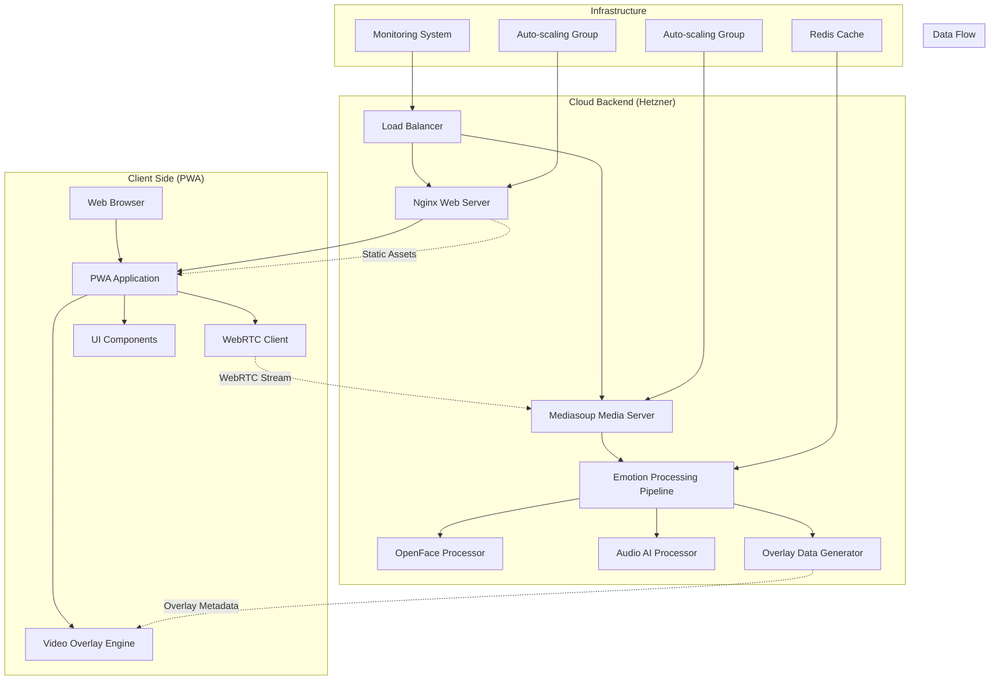
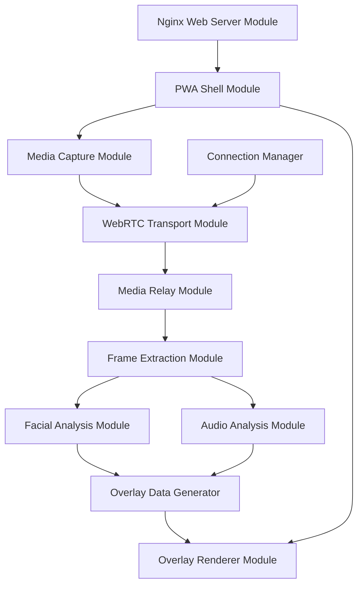

# Design Specification - Emotion Recognition PWA

## Overview

The Emotion Recognition PWA is a real-time system that captures video and audio from user devices, streams the media to a cloud backend for AI-powered emotion analysis, and displays emotion overlays on the live video feed. The system is designed to handle 1000 simultaneous connections while maintaining sub-500ms latency.

The architecture follows a client-server model with WebRTC for real-time media streaming, Mediasoup for scalable media relay, OpenFace for facial emotion recognition, and AI models for voice emotion detection.

## Usage Scenarios (Gherkin Style)

### Scenario 1: User Starts Emotion Recognition Session

```gherkin
Feature: Real-time Emotion Recognition
  As a user
  I want to start an emotion recognition session
  So that I can see my emotions analyzed in real-time

Scenario: Successful session initialization
  Given the user opens the PWA in their browser
  When the user clicks "Start Emotion Recognition"
  Then the Media Capture Module requests camera and microphone permissions
  And the browser displays permission dialog for camera and microphone access
  When the user grants permissions
  Then the Media Capture Module creates MediaStream with video constraints (1280x720, 30fps) and audio constraints (48kHz, stereo)
  And the PWA Shell Module displays the live video feed
  And the WebRTC Transport Module initializes peer connection with STUN servers
  And the WebRTC Transport Module connects to signaling server
  And the Connection Manager Module generates unique sessionId and creates session record
  Then the system displays "Connected - Ready for emotion analysis" status message
```

### Scenario 2: Real-time Emotion Processing Pipeline

```gherkin
Scenario: Processing live video and audio for emotions
  Given the user has an active emotion recognition session
  And the WebRTC connection is established
  When the user's face appears in the video feed
  Then the Media Capture Module streams video frames at 30fps via WebRTC to Mediasoup server
  And the Media Relay Module receives RTP H.264 video packets on WebRtcTransport
  And the Media Relay Module creates Producer for incoming video stream
  And the Media Relay Module forwards RTP packets to Frame Extraction Module via PlainTransport
  And the Frame Extraction Module uses FFmpeg to decode RTP video streams to RGBA frames
  And the Frame Extraction Module converts video frames to processable format at 10fps
  And the Facial Analysis Module receives VideoFrame with 1280x720 pixel data
  And the Facial Analysis Module processes frames using OpenFace toolkit
  And the Facial Analysis Module extracts facial Action Units for emotion classification
  And the Facial Analysis Module maps Action Units to basic emotions (Happy, Sad, Angry, etc.)
  And the Audio Analysis Module processes 1-second audio chunks using MFCC feature extraction
  And the Audio Analysis Module analyzes audio using trained CNN emotion model
  And the Audio Analysis Module classifies emotions from voice patterns
  Then the Overlay Data Generator combines facial emotions (confidence: 0.85, emotion: "happy") with audio emotions (confidence: 0.72, emotion: "happy")
  And the Overlay Data Generator creates JSON payload: {"sessionId": "abc123", "timestamp": 1642781234567, "facialOverlays": [{"faceId": "face_1", "boundingBox": {"x": 320, "y": 180, "width": 200, "height": 240}, "emotionLabel": "Happy", "confidence": 0.85, "color": "#00FF00"}], "audioOverlay": {"emotionLabel": "Happy", "confidence": 0.72, "position": "top"}}
  And the Media Relay Module sends overlay data via WebRTC DataChannel named "overlayData"
  And the WebRTC Transport Module receives overlay data on client side
  And the Overlay Renderer Module draws green bounding box at coordinates (320, 180, 200x240) on Canvas element
  And the Overlay Renderer Module displays "Happy (85%)" label above bounding box
  And the Overlay Renderer Module shows "Audio: Happy (72%)" indicator at top of video
  Then the user sees real-time emotion overlays on their live video feed
  And the total processing latency is measured at 420ms from capture to display
```

### Scenario 3: Multiple Users Concurrent Processing

```gherkin
Scenario: System handles 1000 concurrent users
  Given the Mediasoup server is running with 4 workers (one per CPU core)
  And each worker has Router configured with VP8, H264, Opus, PCMU codecs
  And Redis cluster is running for session state management
  And Nginx load balancer is distributing connections across 4 Mediasoup instances
  When 1000 users simultaneously start emotion recognition sessions
  Then the Connection Manager Module creates 1000 unique sessionIds
  And the Media Relay Module distributes sessions across workers using round-robin: Worker1(250), Worker2(250), Worker3(250), Worker4(250)
  And each worker creates WebRtcTransport with DTLS/SRTP for secure media transmission
  And the Frame Extraction Module processes 10,000 video frames per second (10fps × 1000 users) using Redis queue with 8 worker processes
  And the Facial Analysis Module processes frames in parallel using 16 worker threads
  And the Audio Analysis Module processes 1000 audio chunks per second using GPU acceleration
  And the system maintains CPU usage below 80% across all servers
  And the Redis cache stores frequently accessed ML model weights to reduce loading time
  Then all 1000 users receive emotion overlays with average latency of 450ms
  And the system maintains 99.9% uptime with no connection drops
  And emotion recognition accuracy remains above 85% for facial emotions and 78% for audio emotions
```

## Architecture

### High-Level Architecture



### System Components

1. **PWA Frontend**: TypeScript-based Progressive Web App with WebRTC capabilities
2. **Media Relay Layer**: Mediasoup-based WebRTC media server for scalable streaming
3. **Emotion Processing Pipeline**: Real-time AI processing using OpenFace and audio AI models
4. **Overlay System**: Real-time metadata generation and client-side rendering
5. **Infrastructure Layer**: Load balancing, caching, and monitoring for 1000+ concurrent users

## Module Architecture Design

### Design Principles Applied

1. **Single Responsibility**: Each module handles exactly one concern
2. **Explicit Contracts**: All interfaces defined with versioned schemas
3. **Minimal Dependencies**: Clear dependency graph with no circular dependencies
4. **Swappable Components**: Modules can be replaced without affecting others
5. **Local Failure Handling**: Failures contained within module boundaries

### Module Dependency Graph



## Data Models

### Core Data Types

```typescript
// Facial emotion data structure
interface FacialEmotionData {
  faceId: string;
  boundingBox: BoundingBox;
  landmarks: FacialLandmarks;
  emotions: EmotionClassification[];
  confidence: number;
  timestamp: number;
}

// Audio emotion data structure
interface AudioEmotionData {
  emotions: EmotionClassification[];
  confidence: number;
  audioLevel: number;
  timestamp: number;
  duration: number;
}

// Combined overlay data sent to client
interface OverlayData {
  sessionId: string;
  timestamp: number;
  facialData: FacialEmotionData[];
  audioData: AudioEmotionData;
  processingLatency: number;
}
```

## Error Handling

### Client-Side Error Handling

1. **Media Access Errors**
   - Camera/microphone permission denied
   - Device not available or in use
   - Hardware compatibility issues

2. **Connection Errors**
   - WebRTC connection failures
   - Network connectivity issues
   - Server unavailability

3. **Processing Errors**
   - Overlay rendering failures
   - Data parsing errors
   - Performance degradation

### Server-Side Error Handling

1. **Media Processing Errors**
   - OpenFace processing failures
   - Audio AI model errors
   - Frame corruption or invalid data

2. **Scalability Errors**
   - Resource exhaustion at high load
   - Memory leaks in long-running sessions
   - Connection limit exceeded

3. **Infrastructure Errors**
   - Mediasoup server failures
   - Load balancer issues
   - Cache system failures

## Testing Strategy

### Unit Testing

- **Frontend**: Jest + Testing Library for React components and WebRTC utilities
- **Backend**: Jest + Supertest for API endpoints and processing pipeline
- **OpenFace Integration**: Mock OpenFace responses for consistent testing
- **Audio AI**: Mock audio processing with known emotion datasets

### Integration Testing

- **WebRTC Flow**: End-to-end media streaming between client and server
- **Emotion Pipeline**: Complete processing from raw media to overlay data
- **Error Scenarios**: Connection failures, processing errors, and recovery

### Performance Testing

- **Load Testing**: Simulate 1000 concurrent connections using Artillery or k6
- **Latency Testing**: Measure end-to-end processing time under various loads
- **Memory Testing**: Monitor memory usage during extended sessions
- **Stress Testing**: Push system beyond normal limits to identify breaking points

### Cross-Platform Testing

- **Browser Compatibility**: Chrome, Firefox, Safari, Edge on desktop
- **Mobile Testing**: iOS Safari, Android Chrome, responsive design
- **PWA Features**: Offline functionality, installation, push notifications

## Scalability Considerations

### Horizontal Scaling

- **Mediasoup Clustering**: Multiple media server instances behind load balancer
- **Processing Pipeline**: Distributed emotion processing across multiple workers
- **Auto-scaling**: Dynamic server provisioning based on connection count

### Performance Optimization

- **Frame Rate Adaptation**: Reduce processing frequency under high load
- **Quality Scaling**: Adjust video resolution based on server capacity
- **Caching Strategy**: Redis cache for frequently accessed emotion models
- **Connection Pooling**: Efficient resource management for WebRTC connections

### Monitoring and Metrics

- **Real-time Dashboards**: Connection count, processing latency, error rates
- **Alerting System**: Automated notifications for performance degradation
- **Resource Monitoring**: CPU, memory, and network usage tracking
- **User Experience Metrics**: Client-side performance and satisfaction scores
