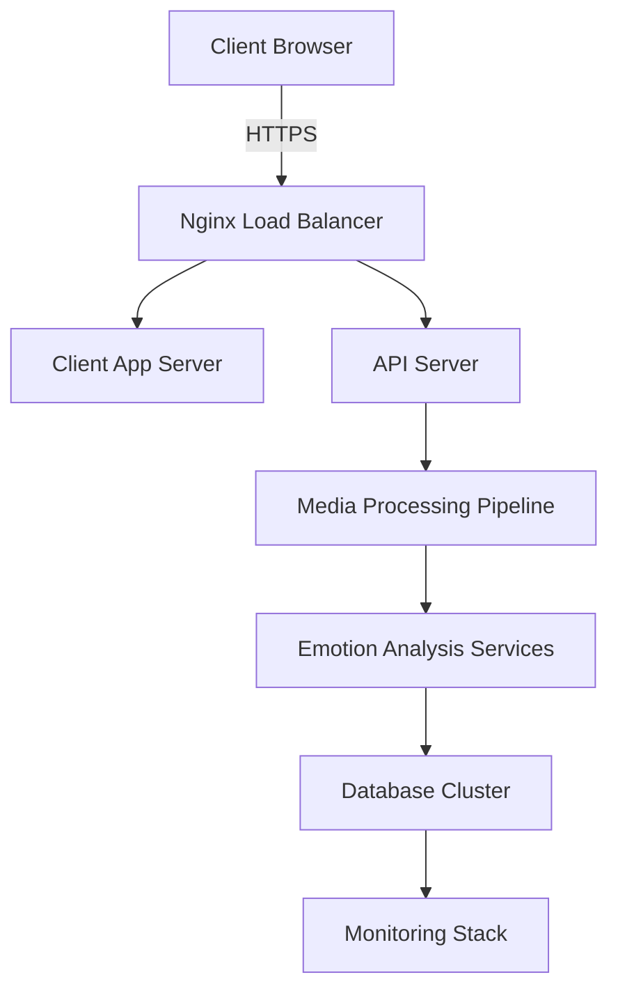

# 🏗️ DevOps Training Guide for Emotion Recognition PWA

## Overview

This comprehensive DevOps training guide covers the complete deployment, monitoring, and operational aspects of the emotion recognition PWA system.

## 📚 Training Modules

### Module 1: Infrastructure Understanding (Week 1)

#### 🏗️ **Architecture Overview**



#### **Docker Architecture**

- **Multi-stage builds** for optimized images
- **Service isolation** per module
- **Volume management** for persistent data
- **Network segmentation** for security

### Module 2: Local Development Setup (Week 2)

#### **Docker Compose Training**

```yaml
# docker-compose.yml explained
version: '3.8'
services:
  nginx:
    build: ./nginx
    ports: ['80:80', '443:443']
    volumes: ['./nginx/nginx.conf:/etc/nginx/nginx.conf']

  client:
    build: ./client
    environment:
      - NODE_ENV=development
    volumes: ['./client:/app', '/app/node_modules']

  server:
    build: ./server
    environment:
      - NODE_ENV=development
      - DATABASE_URL=postgresql://user:pass@db:5432/emotion_db
    depends_on: [db]

  db:
    image: postgres:15
    environment:
      POSTGRES_DB: emotion_db
      POSTGRES_USER: user
      POSTGRES_PASSWORD: pass
    volumes: ['postgres_data:/var/lib/postgresql/data']
```

#### **Hands-on Exercises**

1. **Build and run locally**

   ```bash
   docker-compose up --build
   docker-compose logs -f [service-name]
   ```

2. **Volume debugging**

   ```bash
   docker volume ls
   docker volume inspect [volume-name]
   ```

3. **Network debugging**
   ```bash
   docker network ls
   docker network inspect [network-name]
   ```

### Module 3: CI/CD Pipeline Training (Week 3)

#### **GitHub Actions Workflow**

```yaml
# .github/workflows/ci-cd.yml
name: CI/CD Pipeline
on:
  push: { branches: [main, develop] }
  pull_request: { branches: [main] }

jobs:
  test:
    runs-on: ubuntu-latest
    steps:
      - uses: actions/checkout@v4
      - uses: actions/setup-node@v4
        with: { node-version: '18' }

      - name: Install dependencies
        run: |
          npm ci --prefix client
          npm ci --prefix server

      - name: Run tests
        run: |
          npm test --prefix client
          npm test --prefix server

      - name: Build images
        run: |
          docker build -t emotion-client ./client
          docker build -t emotion-server ./server
```

#### **Pipeline Stages**

1. **Code Quality**: ESLint, Prettier, TypeScript checks
2. **Testing**: Unit tests, integration tests, e2e tests
3. **Security**: Dependency scanning, vulnerability checks
4. **Building**: Docker images, optimization
5. **Deployment**: Staging → Production

### Module 4: Monitoring & Observability (Week 4)

#### **Prometheus + Grafana Setup**

```yaml
# monitoring/docker-compose.yml
version: '3.8'
services:
  prometheus:
    image: prom/prometheus:latest
    ports: ['9090:9090']
    volumes: ['./prometheus.yml:/etc/prometheus/prometheus.yml']

  grafana:
    image: grafana/grafana:latest
    ports: ['3001:3000']
    environment:
      - GF_SECURITY_ADMIN_PASSWORD=admin123

  node-exporter:
    image: prom/node-exporter:latest
    ports: ['9100:9100']
```

#### **Key Metrics to Monitor**

- **Application Metrics**: Response times, error rates, throughput
- **Infrastructure Metrics**: CPU, memory, disk usage, network
- **Business Metrics**: Emotion detection accuracy, user engagement
- **Real-time Alerts**: Error thresholds, performance degradation

### Module 5: Security & Compliance (Week 5)

#### **Security Scanning**

```bash
# Container security
docker run --rm -v /var/run/docker.sock:/var/run/docker.sock \
  aquasec/trivy:latest image emotion-client:latest

# Dependency scanning
npm audit --audit-level=high
npm audit fix

# Secrets scanning
docker run --rm -v $(pwd):/path zricethezav/gitleaks:latest detect --source /path
```

#### **Security Best Practices**

- **Non-root containers**
- **Secret management** with Docker secrets
- **Network policies** and firewall rules
- **Regular security updates**

### Module 6: Scaling & Performance (Week 6)

#### **Horizontal Scaling**

```yaml
# docker-compose.prod.yml
version: '3.8'
services:
  nginx:
    deploy:
      replicas: 2
      resources:
        limits: { cpus: '0.5', memory: 512M }

  client:
    deploy:
      replicas: 3
      resources:
        limits: { cpus: '0.25', memory: 256M }

  server:
    deploy:
      replicas: 4
      resources:
        limits: { cpus: '0.5', memory: 512M }
```

#### **Load Testing**

```bash
# Install artillery
npm install -g artillery

# Create load test
artillery quick --count 50 --num 100 http://localhost:3000

# Advanced load test
artillery run load-test.yml
```

## 🎯 **Hands-on Training Exercises**

### Exercise 1: Local Environment Setup

```bash
# Clone and setup
git clone [repo-url]
cd emotion-recognition-pwa

# Build and run
docker-compose up --build -d

# Verify services
docker-compose ps
curl http://localhost:3000/health
```

### Exercise 2: Debugging Container Issues

```bash
# Check logs
docker-compose logs -f server

# Enter container
docker-compose exec server sh

# Debug network
docker-compose exec server ping client

# Check resource usage
docker stats
```

### Exercise 3: CI/CD Pipeline

```bash
# Test locally
act -j test

# Simulate deployment
act -j deploy --secret-file .secrets

# Check workflow status
gh workflow view
```

### Exercise 4: Monitoring Setup

```bash
# Start monitoring stack
cd monitoring && docker-compose up -d

# Access dashboards
open http://localhost:3001  # Grafana
open http://localhost:9090  # Prometheus

# Create custom dashboard
grafana-cli admin reset-admin-password newpassword
```

## 📊 **Monitoring Dashboard Templates**

### Application Dashboard

- Request rate and response times
- Error rates by endpoint
- Active WebRTC connections
- Emotion detection accuracy

### Infrastructure Dashboard

- Container resource usage
- Network traffic patterns
- Database performance metrics
- Storage utilization

### Business Dashboard

- User engagement metrics
- Feature usage analytics
- Performance impact on user experience
- Cost optimization tracking

## 🔧 **DevOps Tools Training**

### Essential Tools

1. **Docker & Docker Compose** - Containerization
2. **Kubernetes** - Orchestration (advanced)
3. **GitHub Actions** - CI/CD
4. **Prometheus & Grafana** - Monitoring
5. **ELK Stack** - Logging (Elasticsearch, Logstash, Kibana)
6. **Terraform** - Infrastructure as Code

### Daily Operations Checklist

- [ ] Check application health endpoints
- [ ] Review error logs and alerts
- [ ] Monitor resource usage trends
- [ ] Verify backup processes
- [ ] Update security patches
- [ ] Review performance metrics

## 🚨 **Incident Response Training**

### Incident Classification

- **P0**: Complete system outage
- **P1**: Major feature degradation
- **P2**: Minor issues or performance problems
- **P3**: Documentation or cosmetic issues

### Response Playbooks

1. **Service Down**: Check container status → Restart → Investigate logs
2. **High Error Rate**: Check application logs → Review recent deployments → Rollback if needed
3. **Performance Issues**: Check resource usage → Scale services → Optimize queries
4. **Security Incident**: Isolate affected services → Patch vulnerabilities → Review access logs

## 📈 **Performance Optimization**

### Database Optimization

```sql
-- Create indexes for emotion data
CREATE INDEX idx_emotion_timestamp ON emotion_data(timestamp);
CREATE INDEX idx_emotion_user ON emotion_data(user_id);
CREATE INDEX idx_emotion_type ON emotion_data(emotion_type);
```

### Caching Strategy

```yaml
# Redis configuration
redis:
  image: redis:7-alpine
  command: redis-server --maxmemory 256mb --maxmemory-policy allkeys-lru
  ports: ['6379:6379']
```

### CDN Setup

```nginx
# nginx.conf for CDN
location ~* \.(js|css|png|jpg|jpeg|gif|ico|svg)$ {
    expires 1y;
    add_header Cache-Control "public, immutable";
    add_header Vary Accept-Encoding;
}
```

## 🎓 **Certification Path**

### Level 1: Foundation (2 weeks)

- Docker fundamentals
- Basic CI/CD setup
- Monitoring basics

### Level 2: Intermediate (3 weeks)

- Advanced Docker features
- Kubernetes introduction
- Security best practices

### Level 3: Expert (4 weeks)

- Kubernetes orchestration
- Advanced monitoring
- Performance optimization

## 📚 **Additional Resources**

### Documentation

- [Docker Best Practices](https://docs.docker.com/develop/dev-best-practices/)
- [Kubernetes Documentation](https://kubernetes.io/docs/)
- [Prometheus Monitoring](https://prometheus.io/docs/)

### Training Videos

- Docker Deep Dive (4 hours)
- Kubernetes Fundamentals (6 hours)
- Monitoring & Observability (3 hours)

### Practice Environments

- Local Docker setup
- Minikube for Kubernetes
- Play with Docker (online)

## 🎯 **Next Steps**

1. Complete Week 1 exercises
2. Set up local monitoring stack
3. Create first CI/CD pipeline
4. Practice incident response scenarios
5. Join DevOps team standups
