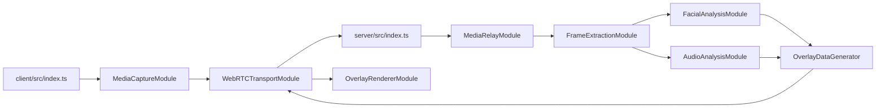
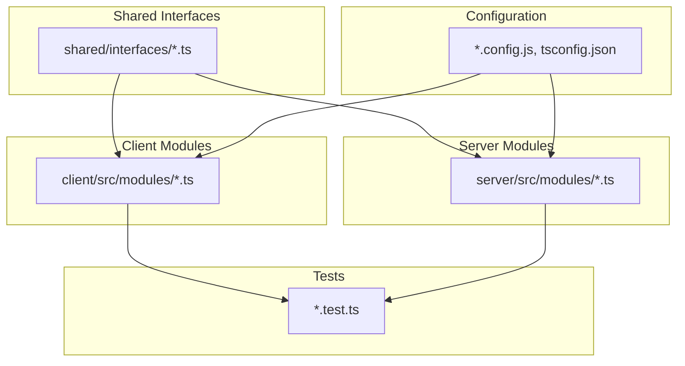

# File Documentation Matrix - Emotion Recognition PWA

## Overview

This document provides comprehensive documentation for every file in the emotion recognition PWA project, including purpose, technology stack, dependencies, and role in the overall system architecture.

## 📁 **Core Application Files**

### **Shared Interfaces (`shared/interfaces/`)**

| File                              | Purpose                               | Technology                    | Dependencies                    | Role in System                                              |
| --------------------------------- | ------------------------------------- | ----------------------------- | ------------------------------- | ----------------------------------------------------------- |
| `common.interface.ts`             | Base types and shared data structures | TypeScript                    | None                            | Defines ApiResponse, ModuleError, EmotionScore, BoundingBox |
| `media-capture.interface.ts`      | Media device access contract          | TypeScript, WebRTC APIs       | common.interface.ts             | Defines getUserMedia wrapper and device management          |
| `webrtc-transport.interface.ts`   | Real-time communication contract      | TypeScript, WebRTC, Socket.IO | common.interface.ts             | Defines peer connection and signaling protocols             |
| `frame-extraction.interface.ts`   | Video/audio processing contract       | TypeScript, FFmpeg            | media-relay.interface.ts        | Defines frame decoding and format conversion                |
| `facial-analysis.interface.ts`    | Facial emotion recognition contract   | TypeScript, OpenFace          | frame-extraction.interface.ts   | Defines Action Unit extraction and emotion mapping          |
| `audio-analysis.interface.ts`     | Voice emotion recognition contract    | TypeScript, Python ML         | frame-extraction.interface.ts   | Defines MFCC features and CNN emotion classification        |
| `overlay-data.interface.ts`       | Emotion overlay metadata contract     | TypeScript                    | facial-analysis, audio-analysis | Defines emotion fusion and overlay generation               |
| `overlay-renderer.interface.ts`   | Client-side rendering contract        | TypeScript, Canvas API        | overlay-data.interface.ts       | Defines bounding box and label rendering                    |
| `connection-manager.interface.ts` | Session management contract           | TypeScript, Redis             | webrtc-transport.interface.ts   | Defines session lifecycle and health monitoring             |
| `pwa-shell.interface.ts`          | Progressive Web App contract          | TypeScript, Service Workers   | media-capture.interface.ts      | Defines PWA features and offline handling                   |
| `nginx-server.interface.ts`       | Web server configuration contract     | TypeScript, Nginx             | None                            | Defines static asset serving and SSL configuration          |
| `media-relay.interface.ts`        | Media server scaling contract         | TypeScript, Mediasoup         | None                            | Defines WebRTC media routing and worker management          |

### **Client-Side Modules (`client/src/modules/`)**

| File                                             | Purpose                               | Technology                               | Dependencies                  | Role in System                                                            |
| ------------------------------------------------ | ------------------------------------- | ---------------------------------------- | ----------------------------- | ------------------------------------------------------------------------- |
| `media-capture/MediaCaptureModule.ts`            | Device media access implementation    | TypeScript, getUserMedia API             | media-capture.interface.ts    | Captures video/audio from user devices with permission handling           |
| `media-capture/MediaCaptureModule.test.ts`       | Unit tests for media capture          | Jest, TypeScript                         | MediaCaptureModule.ts         | Validates device access, permission handling, and error scenarios         |
| `webrtc-transport/WebRTCTransportModule.ts`      | WebRTC peer connection implementation | TypeScript, RTCPeerConnection, Socket.IO | webrtc-transport.interface.ts | Establishes real-time communication with backend server                   |
| `webrtc-transport/WebRTCTransportModule.test.ts` | Unit tests for WebRTC transport       | Jest, TypeScript                         | WebRTCTransportModule.ts      | Validates connection establishment, data transmission, and reconnection   |
| `overlay-renderer/OverlayRendererModule.ts`      | Canvas-based overlay rendering        | TypeScript, HTML5 Canvas API             | overlay-renderer.interface.ts | Draws emotion overlays on live video feed                                 |
| `overlay-renderer/OverlayRendererModule.test.ts` | Unit tests for overlay rendering      | Jest, TypeScript                         | OverlayRendererModule.ts      | Validates overlay drawing, positioning, and cleanup                       |
| `pwa-shell/PWAShellModule.ts`                    | Progressive Web App features          | TypeScript, Service Workers, Cache API   | pwa-shell.interface.ts        | Provides offline functionality, installation, and push notifications      |
| `pwa-shell/PWAShellModule.test.ts`               | Unit tests for PWA features           | Jest, TypeScript                         | PWAShellModule.ts             | Validates service worker registration, offline handling, and installation |

### **Server-Side Modules (`server/src/modules/`)**

| File                                                 | Purpose                                  | Technology                                | Dependencies                    | Role in System                                                                 |
| ---------------------------------------------------- | ---------------------------------------- | ----------------------------------------- | ------------------------------- | ------------------------------------------------------------------------------ |
| `media-relay/MediaRelayModule.ts`                    | Scalable WebRTC media server             | TypeScript, Mediasoup, Redis              | media-relay.interface.ts        | Routes media streams across multiple workers for scalability                   |
| `media-relay/MediaRelayModule.test.ts`               | Unit tests for media relay               | Jest, TypeScript                          | MediaRelayModule.ts             | Validates worker creation, media routing, and load balancing                   |
| `frame-extraction/FrameExtractionModule.ts`          | Video/audio frame processing             | TypeScript, FFmpeg, Node.js child_process | frame-extraction.interface.ts   | Decodes RTP streams to processable video frames and audio chunks               |
| `frame-extraction/FrameExtractionModule.test.ts`     | Unit tests for frame extraction          | Jest, TypeScript                          | FrameExtractionModule.ts        | Validates frame decoding, quality settings, and format conversion              |
| `facial-analysis/FacialAnalysisModule.ts`            | OpenFace facial emotion recognition      | TypeScript, OpenFace 2.0, child_process   | facial-analysis.interface.ts    | Processes video frames to extract facial Action Units and classify emotions    |
| `facial-analysis/FacialAnalysisModule.test.ts`       | Unit tests for facial analysis           | Jest, TypeScript                          | FacialAnalysisModule.ts         | Validates OpenFace integration, emotion classification, and face tracking      |
| `audio-analysis/AudioAnalysisModule.ts`              | Voice emotion recognition                | TypeScript, Python, librosa, TensorFlow   | audio-analysis.interface.ts     | Analyzes audio chunks using MFCC features and CNN models for emotion detection |
| `audio-analysis/AudioAnalysisModule.test.ts`         | Unit tests for audio analysis            | Jest, TypeScript                          | AudioAnalysisModule.ts          | Validates audio processing, feature extraction, and emotion classification     |
| `overlay-generator/OverlayDataGenerator.ts`          | Emotion data fusion and overlay creation | TypeScript                                | overlay-data.interface.ts       | Combines facial and audio emotion results into unified overlay metadata        |
| `overlay-generator/OverlayDataGenerator.test.ts`     | Unit tests for overlay generation        | Jest, TypeScript                          | OverlayDataGenerator.ts         | Validates emotion fusion, overlay creation, and JSON serialization             |
| `connection-manager/ConnectionManagerModule.ts`      | Session lifecycle management             | TypeScript, Redis, Socket.IO              | connection-manager.interface.ts | Manages WebRTC sessions, health monitoring, and reconnection handling          |
| `connection-manager/ConnectionManagerModule.test.ts` | Unit tests for connection management     | Jest, TypeScript                          | ConnectionManagerModule.ts      | Validates session creation, health monitoring, and cleanup                     |
| `nginx-server/NginxWebServerModule.ts`               | Web server configuration                 | TypeScript, Nginx configuration           | nginx-server.interface.ts       | Serves PWA static assets with SSL, compression, and load balancing             |
| `nginx-server/NginxWebServerModule.test.ts`          | Unit tests for web server                | Jest, TypeScript                          | NginxWebServerModule.ts         | Validates asset serving, SSL configuration, and health checks                  |

## 🔧 **Configuration Files**

### **Build & Development Configuration**

| File                       | Purpose                                    | Technology               | Dependencies        | Role in System                                                          |
| -------------------------- | ------------------------------------------ | ------------------------ | ------------------- | ----------------------------------------------------------------------- |
| `package.json` (root)      | Root project configuration and scripts     | npm, Node.js             | None                | Orchestrates development workflow, testing, and deployment              |
| `client/package.json`      | Client-side dependencies and build scripts | npm, Webpack, TypeScript | None                | Manages PWA build process and client dependencies                       |
| `server/package.json`      | Server-side dependencies and runtime       | npm, Node.js, TypeScript | None                | Manages backend runtime dependencies and server scripts                 |
| `client/webpack.config.js` | Client build configuration                 | Webpack 5, TypeScript    | client/package.json | Bundles PWA for production with optimization and PWA features           |
| `client/tsconfig.json`     | Client TypeScript configuration            | TypeScript compiler      | None                | Configures TypeScript compilation for browser environment               |
| `server/tsconfig.json`     | Server TypeScript configuration            | TypeScript compiler      | None                | Configures TypeScript compilation for Node.js environment               |
| `docker-compose.yml`       | Development environment orchestration      | Docker, Docker Compose   | None                | Provides Redis, Nginx, and application containers for local development |

### **Testing Configuration**

| File                                | Purpose                           | Technology            | Dependencies        | Role in System                                                         |
| ----------------------------------- | --------------------------------- | --------------------- | ------------------- | ---------------------------------------------------------------------- |
| `client/jest.config.js`             | Client-side testing configuration | Jest, jsdom           | client/package.json | Configures unit testing for PWA components with browser environment    |
| `server/jest.config.js`             | Server-side testing configuration | Jest, Node.js         | server/package.json | Configures unit testing for backend modules with Node.js environment   |
| `server/jest.integration.config.js` | Integration testing configuration | Jest, Supertest       | server/package.json | Configures end-to-end testing for API endpoints and module integration |
| `client/src/setupTests.ts`          | Client test environment setup     | Jest, Testing Library | None                | Provides mocks for browser APIs (MediaStream, RTCPeerConnection)       |
| `server/src/setupTests.ts`          | Server test environment setup     | Jest                  | None                | Provides mocks for external services (OpenFace, Python processes)      |

### **Code Quality Configuration**

| File                  | Purpose                       | Technology            | Dependencies | Role in System                                        |
| --------------------- | ----------------------------- | --------------------- | ------------ | ----------------------------------------------------- |
| `.eslintrc.js` (root) | Global linting rules          | ESLint, TypeScript    | None         | Enforces code quality standards across entire project |
| `client/.eslintrc.js` | Client-specific linting rules | ESLint, React rules   | .eslintrc.js | Adds browser-specific and PWA linting rules           |
| `server/.eslintrc.js` | Server-specific linting rules | ESLint, Node.js rules | .eslintrc.js | Adds Node.js-specific and backend linting rules       |
| `.prettierrc`         | Code formatting configuration | Prettier              | None         | Ensures consistent code formatting across all files   |
| `.husky/pre-commit`   | Pre-commit git hook           | Husky, lint-staged    | None         | Runs linting and formatting checks before commits     |
| `.husky/pre-push`     | Pre-push git hook             | Husky                 | None         | Runs unit tests before pushing to remote repository   |

## 🌐 **PWA & Web Assets**

| File                          | Purpose                                  | Technology                     | Dependencies | Role in System                                                |
| ----------------------------- | ---------------------------------------- | ------------------------------ | ------------ | ------------------------------------------------------------- |
| `client/public/index.html`    | Main HTML entry point                    | HTML5, PWA meta tags           | None         | Provides PWA shell and loads JavaScript bundle                |
| `client/public/manifest.json` | PWA manifest configuration               | PWA specification              | None         | Defines PWA installation behavior, icons, and display mode    |
| `client/public/sw.js`         | Service worker for offline functionality | Service Workers API, Cache API | None         | Enables offline functionality and background sync             |
| `nginx/nginx.conf`            | Web server configuration                 | Nginx                          | None         | Serves PWA assets with SSL, compression, and security headers |

## 🚀 **Infrastructure & Deployment**

| File                            | Purpose                         | Technology                | Dependencies | Role in System                                                |
| ------------------------------- | ------------------------------- | ------------------------- | ------------ | ------------------------------------------------------------- |
| `.github/workflows/ci.yml`      | Continuous integration pipeline | GitHub Actions, Docker    | None         | Automates testing, building, and deployment on code changes   |
| `.github/branch-protection.yml` | Branch protection rules         | GitHub API                | None         | Enforces code review and testing requirements for main branch |
| `scripts/health-check.js`       | System health monitoring        | Node.js, HTTP requests    | None         | Validates all services are running and responsive             |
| `scripts/debug-webrtc.js`       | WebRTC debugging utilities      | Node.js, WebRTC debugging | None         | Provides tools for diagnosing WebRTC connection issues        |
| `scripts/interactive-dev.js`    | Development workflow tools      | Node.js, CLI utilities    | None         | Interactive tools for development tasks and debugging         |
| `scripts/module-monitor.js`     | Module performance monitoring   | Node.js, system metrics   | None         | Monitors individual module performance and resource usage     |

## 🔒 **Environment & Security**

| File               | Purpose                        | Technology            | Dependencies | Role in System                                                                 |
| ------------------ | ------------------------------ | --------------------- | ------------ | ------------------------------------------------------------------------------ |
| `.env.example`     | Environment variable template  | Environment variables | None         | Documents all required configuration options                                   |
| `.env.development` | Development environment config | Environment variables | None         | Local development configuration (database URLs, API keys)                      |
| `.env.staging`     | Staging environment config     | Environment variables | None         | Pre-production testing configuration                                           |
| `.env.production`  | Production environment config  | Environment variables | None         | Live deployment configuration with production secrets                          |
| `.gitignore`       | Version control exclusions     | Git                   | None         | Excludes sensitive files, build outputs, and dependencies from version control |

## 🔗 **Interface Architecture**

### **Explicit Import Strategy**

The system uses explicit interface imports instead of a central export hub to achieve:

- **Minimal Dependencies**: Each module imports only the interfaces it actually uses
- **Tree Shaking**: Build tools can eliminate unused interfaces for smaller bundles
- **Clear Dependencies**: Import statements explicitly show module relationships
- **Independent Development**: Modules can be developed without coordinating through a central hub

### **Interface Dependency Matrix**

| Interface File                    | Imports From                                                                         | Used By Modules                                                  |
| --------------------------------- | ------------------------------------------------------------------------------------ | ---------------------------------------------------------------- |
| `common.interface.ts`             | None (foundation layer)                                                              | All modules requiring base types                                 |
| `media-capture.interface.ts`      | `common.interface.ts`                                                                | MediaCaptureModule, tests                                        |
| `webrtc-transport.interface.ts`   | `common.interface.ts`                                                                | WebRTCTransportModule, tests                                     |
| `frame-extraction.interface.ts`   | `media-relay.interface.ts`                                                           | FrameExtractionModule, FacialAnalysisModule, AudioAnalysisModule |
| `facial-analysis.interface.ts`    | `common.interface.ts`, `frame-extraction.interface.ts`                               | FacialAnalysisModule, OverlayDataGenerator, tests                |
| `audio-analysis.interface.ts`     | `common.interface.ts`, `frame-extraction.interface.ts`                               | AudioAnalysisModule, OverlayDataGenerator                        |
| `overlay-data.interface.ts`       | `audio-analysis.interface.ts`, `facial-analysis.interface.ts`, `common.interface.ts` | OverlayDataGenerator, OverlayRendererModule                      |
| `overlay-renderer.interface.ts`   | `overlay-data.interface.ts`                                                          | OverlayRendererModule                                            |
| `connection-manager.interface.ts` | `common.interface.ts`                                                                | ConnectionManagerModule                                          |
| `pwa-shell.interface.ts`          | None                                                                                 | PWAShellModule                                                   |
| `nginx-server.interface.ts`       | None                                                                                 | NginxWebServerModule                                             |
| `media-relay.interface.ts`        | None                                                                                 | MediaRelayModule, FrameExtractionModule                          |

### **Import Examples**

```typescript
// Explicit, minimal imports - each module imports only what it needs
import { MediaCaptureModule, CaptureConfig } from '@/shared/interfaces/media-capture.interface';
import { EmotionScore, BoundingBox } from '@/shared/interfaces/common.interface';

// Cross-module dependencies are explicit
import { ExtractedVideoFrame } from '@/shared/interfaces/frame-extraction.interface';
import { FacialAnalysisResult } from '@/shared/interfaces/facial-analysis.interface';
```

## 📚 **Documentation**

| File                           | Purpose                           | Technology                  | Dependencies | Role in System                                            |
| ------------------------------ | --------------------------------- | --------------------------- | ------------ | --------------------------------------------------------- |
| `README.md`                    | Project overview and quick start  | Markdown                    | None         | Primary documentation entry point with setup instructions |
| `docs/ARCHITECTURE.md`         | System architecture documentation | Markdown, Mermaid diagrams  | None         | Detailed system design and module relationships           |
| `docs/DESIGN_SPECIFICATION.md` | Detailed design documentation     | Markdown, Gherkin scenarios | None         | Usage scenarios and technical implementation details      |
| `docs/IMPLEMENTATION_PLAN.md`  | Development roadmap               | Markdown                    | None         | Task breakdown and development timeline                   |
| `docs/BUILD_GUIDE.md`          | Build and deployment instructions | Markdown                    | None         | Step-by-step build and deployment procedures              |
| `docs/DEBUGGING_GUIDE.md`      | Troubleshooting documentation     | Markdown                    | None         | Common issues and debugging techniques                    |
| `docs/GITHUB_SETUP.md`         | Repository configuration guide    | Markdown                    | None         | GitHub-specific setup and configuration                   |
| `docs/NODE_COMPATIBILITY.md`   | Node.js version requirements      | Markdown                    | None         | Node.js compatibility matrix and upgrade procedures       |
| `docs/FILE_DOCUMENTATION.md`   | Complete file reference matrix    | Markdown                    | None         | Documents purpose and dependencies of every project file  |
| `typedoc.json`                 | API documentation generation      | TypeDoc                     | None         | Generates API documentation from TypeScript interfaces    |

## 🎯 **Entry Points & Application Flow**

### **Application Entry Points**

| File                  | Purpose                        | Technology                     | Dependencies       | Role in System                                                            |
| --------------------- | ------------------------------ | ------------------------------ | ------------------ | ------------------------------------------------------------------------- |
| `client/src/index.ts` | Client application entry point | TypeScript, DOM APIs           | All client modules | Initializes PWA, sets up modules, and starts emotion recognition          |
| `server/src/index.ts` | Server application entry point | TypeScript, Express, Socket.IO | All server modules | Starts HTTP server, WebSocket server, and initializes processing pipeline |

### **Data Flow Architecture**



## 🔍 **Technology Stack Summary**

### **Frontend Technologies**

- **TypeScript**: Type-safe JavaScript development
- **WebRTC**: Real-time peer-to-peer communication
- **Canvas API**: 2D graphics rendering for overlays
- **Service Workers**: Offline functionality and caching
- **Webpack**: Module bundling and optimization

### **Backend Technologies**

- **Node.js**: JavaScript runtime environment
- **Mediasoup**: Scalable WebRTC media server
- **FFmpeg**: Video and audio processing
- **OpenFace**: Facial landmark detection and emotion analysis
- **Python/TensorFlow**: Audio emotion recognition models
- **Redis**: Session state management and caching

### **Infrastructure Technologies**

- **Nginx**: Web server and reverse proxy
- **Docker**: Containerization and deployment
- **GitHub Actions**: CI/CD pipeline automation
- **Jest**: Unit and integration testing framework

## 📊 **File Dependency Matrix**

This matrix shows which files depend on which other files:



## 🎯 **Quick Reference**

### **Find Files by Purpose**

- **Module Interfaces**: `shared/interfaces/*.interface.ts`
- **Client Implementation**: `client/src/modules/*/Module.ts`
- **Server Implementation**: `server/src/modules/*/Module.ts`
- **Unit Tests**: `*/*.test.ts`
- **Configuration**: `*.config.js`, `tsconfig.json`, `.eslintrc.js`
- **Documentation**: `docs/*.md`, `README.md`
- **Build Scripts**: `package.json` (scripts section)

### **Find Files by Technology**

- **TypeScript**: `*.ts` files
- **WebRTC**: `webrtc-transport/`, `media-relay/`
- **AI/ML**: `facial-analysis/`, `audio-analysis/`
- **PWA**: `pwa-shell/`, `manifest.json`, `sw.js`
- **Testing**: `*.test.ts`, `jest.config.js`, `setupTests.ts`
- **Infrastructure**: `docker-compose.yml`, `nginx.conf`, `.github/`

This documentation provides a complete reference for understanding the purpose, technology, and role of every file in the emotion recognition PWA project.
